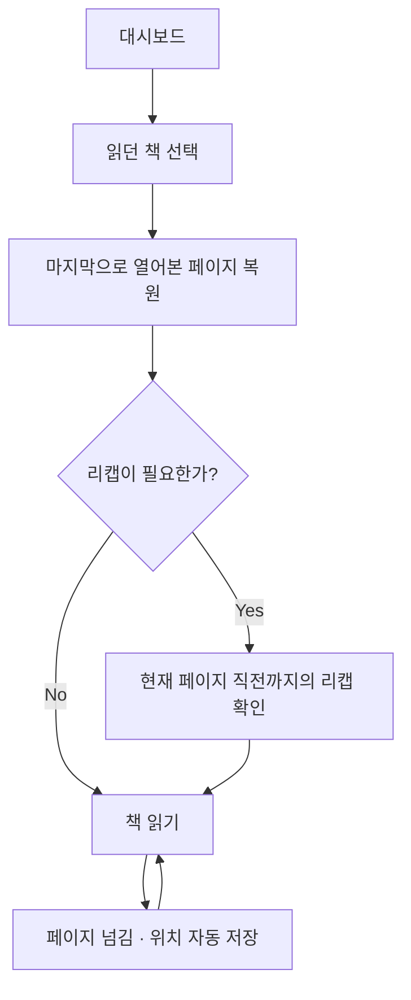
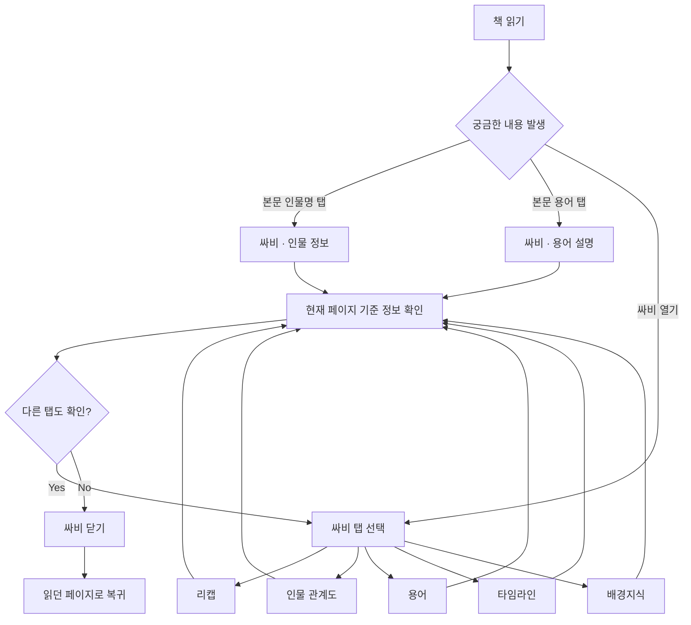
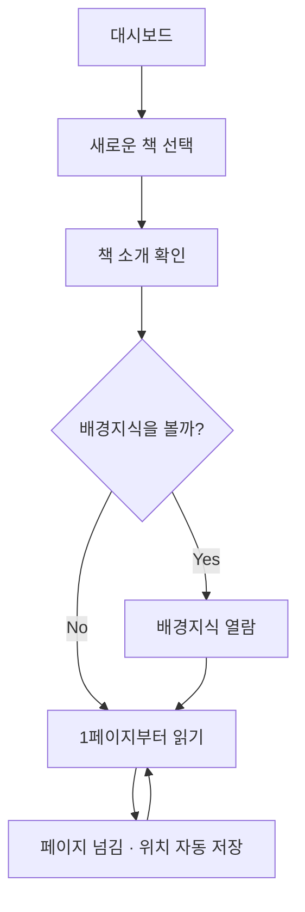
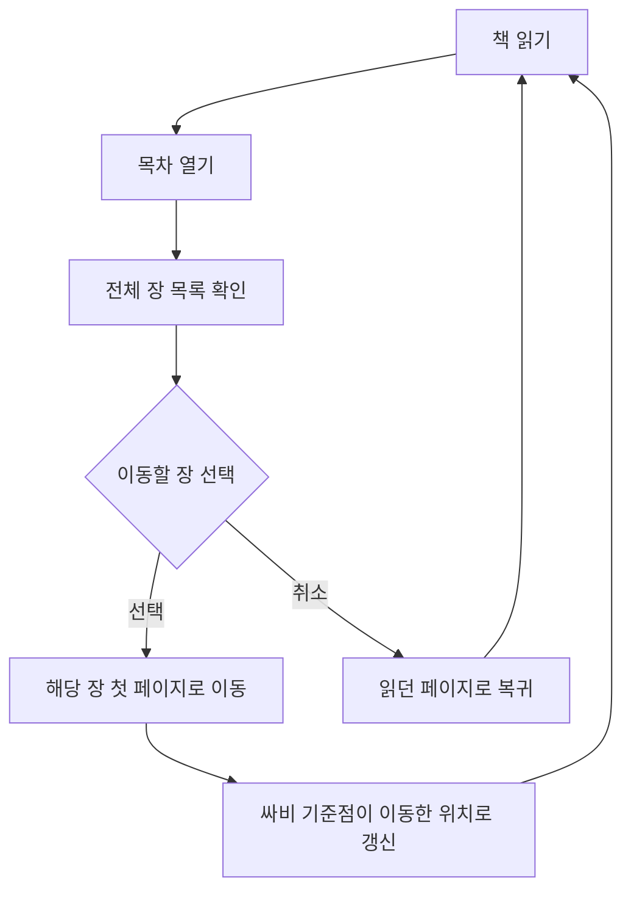

# User Flow

**버전** v0.2 · **기준** FR/NFR v0.4, 8/17 팀 결정

## v0.2 변경 사항

| 항목 | v0.1 | v0.2 |
| --- | --- | --- |
| Flow B 용어·설정 | 챗봇으로 연결 | **싸비 용어 탭**으로 변경 (챗봇은 P2) |
| Flow B 배경지식 | 없음 | **싸비 배경지식 탭 추가** |
| Flow B 타임라인 | 없음 | 싸비 타임라인 탭 추가 |
| Flow A 리캡 | "리캡이 필요한가" 분기 | 동일. 단 리캡 기준이 **현재 페이지**임을 명시 |
| 전 Flow | 서재 | **대시보드**로 용어 통일 |
| 신규 | — | **Flow D 목차 이동** 추가 |

---

## Flow A — 독서 재개

> 대시보드에는 읽던 책에만 진도 바가 표시된다. 리캡 대상은 **현재 열린 페이지의 직전 페이지까지**이며, 독자가 구간을 지정하지 않는다.
>

---

## Flow B — 읽는 중 정보 확인

> 인물 정보와 용어는 본문에서 바로 진입할 수 있고, 나머지는 싸비를 연 뒤 탭을 선택한다(NFR-USE-002).
배경지식은 첫 접속에서 거부했더라도 싸비 탭으로 언제든 볼 수 있다(FR-BGK-004).
용어·타임라인은 P1이므로 미구현 시 '준비 중' 상태로 표시한다(FR-SVB-002).
>

---

## Flow C — 처음 읽는 경우

> 배경지식 선택은 **도서당 한 번만** 묻는다(FR-BGK-003). 거부해도 읽는 중 싸비에서 볼 수 있다.
책 소개는 표지 밑 칸을 탭해 확인하며, 배경지식과는 별개다(FR-BRW-003).
>

---

## Flow D — 목차 이동

> 목차는 진도와 무관하게 **전체 장 제목이 항상 표시된다.** 목차를 스포일러로 보지 않는다.
이동 후 싸비는 이동한 위치를 따라간다. 뒤로 갔든 앞으로 갔든 **현재 보고 있는 화면이 기준**이다.
>

---

## 전 Flow 공통 규칙

| 규칙 | 내용 |
| --- | --- |
| 싸비 정보 범위 | 현재 열린 페이지의 **직전 페이지까지** |
| 본문 접근 | 제한하지 않음. 목차로 어디든 이동 가능 |
| 기준점 갱신 | 페이지 이동 즉시. 앞뒤 방향 모두 반영 |
| 페이지 내 스크롤 | 기준점을 변경하지 않음 |
| 싸비 이용 | 페이지 위치를 변경하지 않음 |

> **이 서비스가 차단하는 것은 싸비가 제공하는 정보다.** 책은 원래 아무 데나 펼칠 수 있으므로 본문 접근은 막지 않는다. 독자가 어디까지 읽었는지 추론하지 않고, 보고 있는 화면을 기준으로 그 앞을 정리해준다.
>
