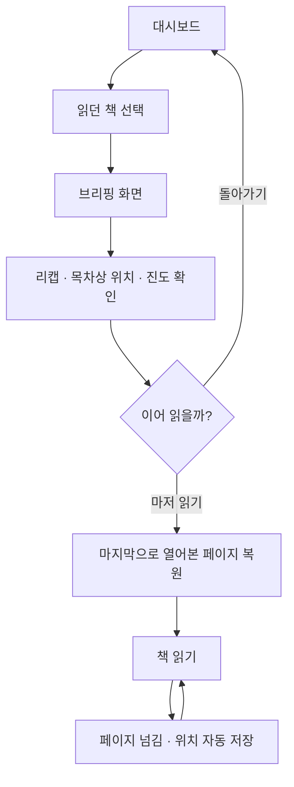
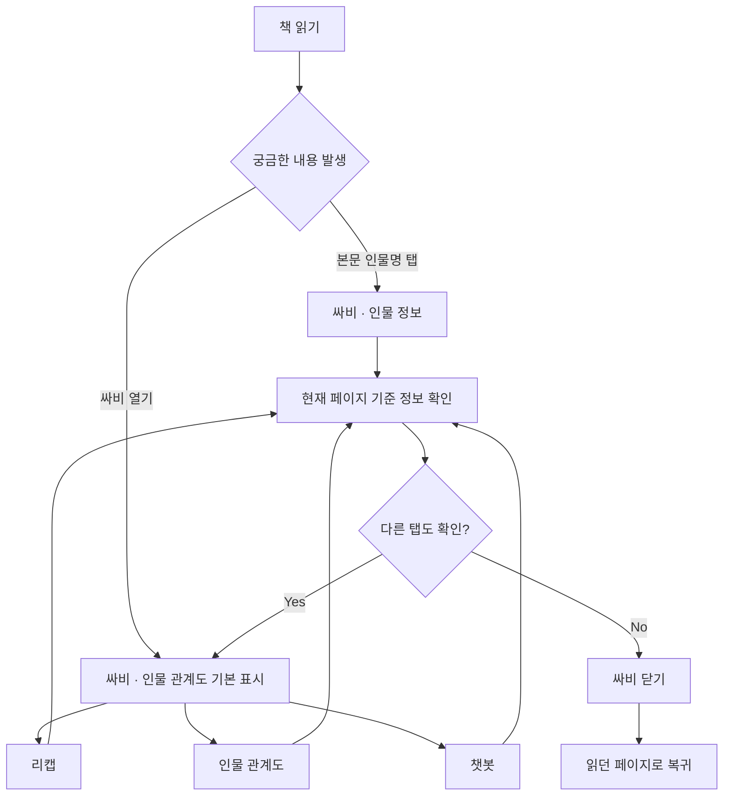
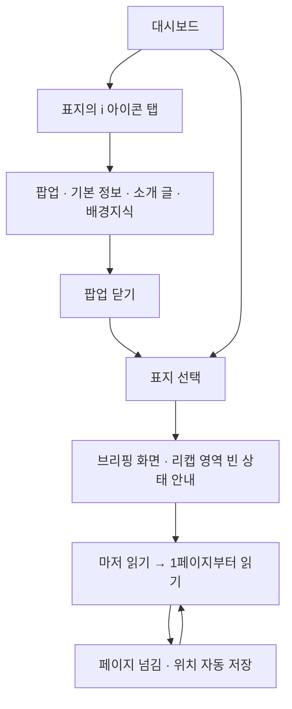
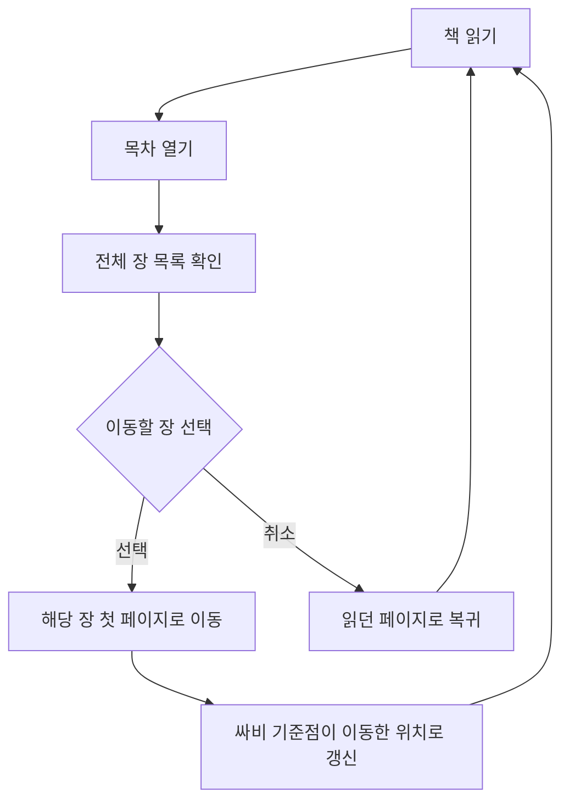

# User Flow

**버전** v0.4 · **기준** FR/NFR v0.6, Use Case v0.4, 아키텍처 설계서 1회차 v0.9, 8/18·8/19 팀 결정

## v0.4 변경 사항 (8/19)

| 항목 | v0.3 | v0.4 |
| --- | --- | --- |
| Flow C 첫 진입 | ❓Q1 미정 | **브리핑 경유 확정.** 리캡 영역은 빈 상태 안내, LLM 호출 0회 |
| Flow C 배경지식 | ❓Q3 미정 | **첫 접속 선택 UI 폐지.** 경로는 표지 `i` 팝업 + 읽는 중 챗봇 질의 2개 |
| Flow B 챗봇 | — | 짧은 시간 반복 질의는 **디바이스·도서당 분당 3회** 상한 |
| 공통 규칙 | — | 미완비 도서는 **카드 선택 불가** + 서버 진입 차단 |

## v0.3 변경 사항 (8/18)

| 항목 | v0.2 | v0.3 |
| --- | --- | --- |
| 싸비 탭 | 5개 | **3개** (리캡·인물 관계도·챗봇). 배경지식은 대시보드 `i` 팝업, 용어·타임라인은 후속 |
| Flow A | 책 선택 → 페이지 복원 → 리캡 분기 | **책 선택 → 브리핑 화면 → 마저 읽기 → 페이지 복원.** 리캡은 브리핑 안에 있다 |
| Flow C | 책 소개 확인 → 배경지식 분기 | **표지 `i` 팝업**에서 기본 정보·소개·배경지식을 함께 확인 |
| Flow B | 탭 선택 | 싸비를 열면 **인물 관계도**가 기본 선택 |
| 공통 | — | 브리핑 정보 범위 · 진도 표시 값 규칙 추가 |

---

## v0.2 변경 사항

| 항목 | v0.1 | v0.2 |
| --- | --- | --- |
| Flow B 용어·설정 | 챗봇으로 연결 | **싸비 용어 탭**으로 변경 (챗봇은 P2) *(v0.3에서 재변경 — 용어 탭 삭제, 챗봇 P0)* |
| Flow B 배경지식 | 없음 | **싸비 배경지식 탭 추가** |
| Flow B 타임라인 | 없음 | 싸비 타임라인 탭 추가 |
| Flow A 리캡 | "리캡이 필요한가" 분기 | 동일. 단 리캡 기준이 **현재 페이지**임을 명시 |
| 전 Flow | 서재 | **대시보드**로 용어 통일 |
| 신규 | — | **Flow D 목차 이동** 추가 |

---

## Flow A — 독서 재개

> 대시보드에는 읽던 책에만 진도 바가 표시된다. **브리핑은 새 세션으로 진입할 때 거친다**(FR-BRF-001). 리캡 대상은 저장된 마지막 페이지의 **직전 페이지까지**이며, 독자가 구간을 지정하지 않는다.
>
> **브리핑의 리캡은 직전 세션이 끝날 때 미리 만들어 둔 것이다**(FR-DAT-009). 세션 종료는 **무조작 30분**으로 판정하며, 사용자가 화면을 보고 있지 않은 동안 생성하므로 대기가 없다.
>
> **30분 이내에 돌아오면 같은 세션이라 브리핑을 거치지 않는다.** 이탈한 적이 없으므로 되살릴 기억도 없다. 브리핑이 뜨는 조건과 리캡이 준비된 조건이 같아서, **브리핑에서 LLM 호출이 발생하지 않는다.**
>
> **리캡의 주 경로가 여기다.** 읽는 중에도 싸비 리캡 탭과 본문 상단 진입점으로 다시 볼 수 있으나(FR-RCP-002), 재개 시점에 리캡을 마주하는 자리는 브리핑이다.
>
> 리캡 생성이 실패해도 **'마저 읽기'는 동작해야 한다**(UC-28 E1). 브리핑이 본문 진입의 유일한 통로이기 때문이다.
>

---

## Flow B — 읽는 중 정보 확인

> 인물 정보는 본문에서 바로 진입할 수 있고, 나머지는 싸비를 연 뒤 탭을 선택한다(NFR-USE-002).
**싸비 탭은 3개다** — 리캡·인물 관계도·챗봇. 열면 **인물 관계도**가 기본으로 선택된다(FR-SVB-002). 재개 시점의 리캡은 브리핑에서 이미 지나오므로, 싸비를 여는 시점에 필요한 것은 대체로 "이 사람이 누구였지"다.
**배경지식 탭은 없다.** 대시보드 표지 `i` 팝업에서 보고, 읽는 중 배경이 궁금해지면 **챗봇에 묻는다**(FR-QNA-006 ③). 배경지식은 진도 상한 대상이 아니다.
용어·타임라인은 후속 확장이며 '준비 중' 탭을 두지 않는다.
>
> **챗봇은 근거를 찾지 못하면 항상 같은 문구로 답한다**(FR-QNA-004). 뒤에 나오는 인물인지 작품에 없는 인물인지 판별하지 않으므로, 판별 결과가 응답 차이로 새어나가지 않는다.
>

---

## Flow C — 처음 읽는 경우

> 기본 정보·소개 글·배경지식은 **표지의 `i` 아이콘 팝업**에서 함께 확인한다(FR-BRW-003). 저장과 표시 모두에서 기본 정보와 배경지식은 영역이 분리된다.
>
> **❓Q1 해소 (8/19) — 첫 진입도 브리핑을 경유한다.** 리캡할 내용이 없으므로(기준점 0) 리캡 영역에 **빈 상태 안내 "아직 읽은 내용이 없습니다"**를 표시하고 생성 호출을 하지 않는다. 목차 위치(1장) · 진도 바(0%) · '마저 읽기'(1페이지 진입)는 정상 동작한다. 브리핑을 건너뛰는 안은 "새 세션이면 브리핑"이라는 단일 규칙에 예외를 하나 더 만드는 값을 못 했다.
>
> **❓Q3 해소 (8/19) — 첫 접속 배경지식 선택 UI는 폐지.** `i` 팝업과 경로가 중복된다. FR-BGK-001·003과 UC-04를 함께 정리했고, 배경지식 경로는 **표지 `i` 팝업 + 읽는 중 챗봇 질의** 2개로 확정됐다.
>

---

## Flow D — 목차 이동

> 목차는 진도와 무관하게 **전체 장 제목이 항상 표시된다.** 목차를 스포일러로 보지 않는다.
이동 후 싸비는 이동한 위치를 따라간다. 뒤로 갔든 앞으로 갔든 **현재 보고 있는 화면이 기준**이다.
>

---

## 전 Flow 공통 규칙

| 규칙 | 내용 |
| --- | --- |
| 브리핑 경유 | **새 세션**으로 진입할 때 거친다. 무조작 30분 이내 재진입은 건너뛰고 읽던 페이지로 직행 |
| 싸비 정보 범위 | 현재 열린 페이지의 **직전 페이지까지** |
| 브리핑 정보 범위 | 저장된 마지막 페이지의 **직전 페이지까지** |
| 진도 표시 값 | 대시보드·브리핑·싸비 모두 **현재 위치** 기준. 최대 도달 값을 두지 않음 |
| 읽기 화면 진도 표시 | **페이지 번호만.** 진도 바를 두지 않음 |
| 본문 접근 | 제한하지 않음. 목차로 어디든 이동 가능 |
| 기준점 갱신 | 페이지 이동 즉시. 앞뒤 방향 모두 반영 |
| 페이지 내 스크롤 | 기준점을 변경하지 않음 |
| 싸비 이용 | 페이지 위치를 변경하지 않음 |
| 세션 판정 | 마지막 조작으로부터 **무조작 30분** 경과 시 종료 |
| 리캡 사전 생성 | 세션 종료 시 그 시점 기준점 리캡 1건을 시스템이 자동 생성·저장 |
| 리캡 재사용 | 저장분은 기준점이 같을 때만 유효. 다르면 요청 시점 실시간 생성 |
| 리캡 생성 조건 | **없음 — 진도와 무관하게 생성한다** (8/18 결정, 10% 미만 미생성 규칙 폐지) |
| 첫 진입 | 브리핑을 경유하되 **리캡 영역은 빈 상태 안내.** 생성 호출 0회 (8/19) |
| 미완비 도서 | 대시보드에 표지만 노출하고 **카드 선택 불가.** 서버 진입 차단 병행 (8/19) |
| 싸비 탭 상태 | 세션 내에서는 마지막 탭 유지, 새 세션이면 기본 탭(인물 관계도)으로 초기화 (8/19) |
| 챗봇 질의 상한 | **디바이스·도서당 분당 3회** (8/19) |

> **이 서비스가 차단하는 것은 싸비가 제공하는 정보다.** 책은 원래 아무 데나 펼칠 수 있으므로 본문 접근은 막지 않는다. 독자가 어디까지 읽었는지 추론하지 않고, 보고 있는 화면을 기준으로 그 앞을 정리해준다.
>
