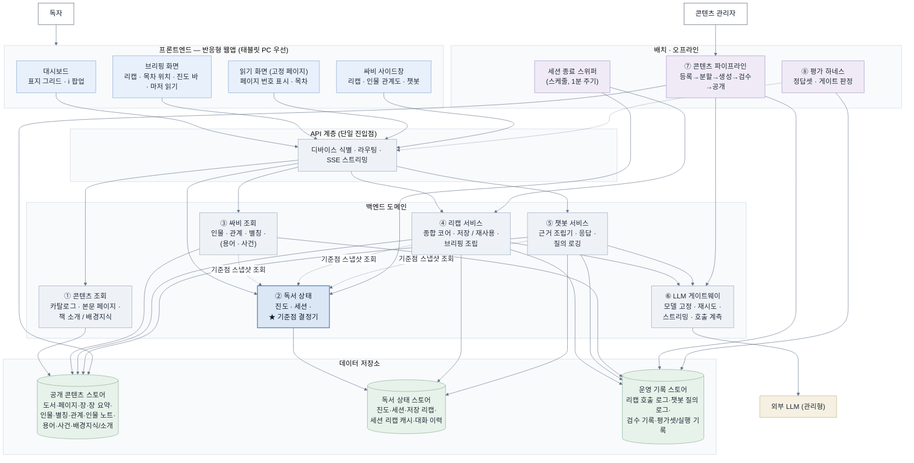

# Reading Recap(싸비) 아키텍처 설계서 — 1회차

**버전** v0.9 · **범위** 논리 · 애플리케이션 · 데이터/AI 아키텍처
**v0.9 변경 (8/19)** — **A11(시연용 후반부 확립 관계 선정) 항목 삭제** — 미결로 두지 않기로 한 팀 결정에 따라 7.1·7.2에서 제거. 데모 시연 시나리오 미확정 항목은 존치한다(7.1)
**v0.8 변경 (8/19)** — ① NFR-AI-001 작업별 모델 배분 — **챗봇 = 난이도 분기(복잡 Sonnet / 그 외 Haiku), 리캡 = Haiku로 진행**. 리캡은 고정이 아니라 품질 확인 후 변경 가능한 잠정값이며, **FR-RCP-001 🚦 환각 0건 재검증이 조건**이다(4.6) ② **챗봇 난이도 분기 = 규칙 기반(알고리즘)** — LLM 라우팅을 두지 않아 런타임 호출 1회가 유지된다. 판정 규칙 자체는 구현 시 결정(4.6, 5.3, R9 주석)
**v0.7 변경 (8/19)** — ① NFR-AI-001 — **개발 착수 시점의 잠정 사용 모델을 Sonnet·Haiku로 정하고, 기능 개발 후 테스트하며 변경**한다(4.6). 최종 선정은 여전히 미확정이며 후보에 Nova Lite가 포함된다 ② **데모 시연 시나리오 미확정** — 기준점 전후 페이지(구 "p.40 → p.80")는 확정된 값이 아니므로 문서에서 제거하고, A11의 근거 서술을 정정한다(7.1)
**v0.6 변경 (8/19)** — ① **❓Q1 해소** — 첫 진입에도 **브리핑 화면을 반드시 경유**하고, 리캡 영역은 **빈 상태 안내("아직 읽은 내용이 없습니다")**로 표시한다. LLM 호출 0회 (1.1, 4.1, 4.2, 4.4.1, 5.2 흐름 B) ② NFR-AI-008 정답셋 담당·기한을 미결에서 내리고 **기능 구현 후 팀 자체 진행**으로 성격 변경 — 게이트 10개 종속 관계는 6.3절에 존치 ③ 7장 갱신 — 남은 미확정은 NFR-AI-001 모델 선정, A11 2건
**v0.5 변경 (8/19 결정 기록 갱신 — D12·오탐 판정 방식 반영)** — ① 잔여 항목 6건 확정(D12): A1 = **디바이스·도서당 분당 질의 3회**(3.2, 4.6) · 브리핑 목차 "읽기" 버튼 **프로토타입에서 제거**(4.1) · FR-RCP-005 **"폐지" 표기로 존치**(3.3, 부록 A) · NFR-AVL-003 **게이트 하향·조항 존치**(0.2, 5.5, 6장) · A8-1 **임베딩 모델 확정**(5.3, 4.6) · A8-2 **성능 측정 후 판단으로 연기**(5.3) ② **게이트 수 30 → 29** — 정답셋 종속 10개 불변(0.2, 6장, 부록 A) ③ FR-QNA-007 오탐 판정을 사전 검증셋 30건 제작에서 **탐색적 테스트 + 기록 기반**으로 변경 — 신설 6.4절, 3.2 ⑧·5.1.3·5.3(top-N 6 고정)·6.2 반영 ④ 7장 갱신 — 남은 미확정: NFR-AI-008 담당·기한(최우선) · NFR-AI-001 선정 · A11 · ❓Q1(보류)
**v0.4 변경 (8/19 결정 기록 갱신 — D11 반영)** — 페이지 분할 단위 확정: 목표 1,000자 · 허용 700~1,400자 · 청크=페이지 **1:1 유지(묶음 폴백 미사용)** · 경계 우선순위 장(절대)>문단>문장. 반영 지점: 4.4.2(분할 규칙·실측 항목) · 5.2 흐름 A · 5.3(종속 조건 해소, top-N 6 확정) · 6.3(최우선 미결 갱신) · 7.1(미결에서 제거)
**v0.3 변경 (8/19 결정 기록 반영 — `decisions-0819-final.md`)** — ① 운영 파라미터 확정값 본문 반영: A1 챗봇 호출량 상한(4.6) · A2 세션 '조작' 이벤트(4.4.1) · A3 스위퍼 주기 1분(4.4.1) ② NFR-AI-001 모델 테스트 판정 기준 반영(4.6) ③ 성능 측정 환경 확정 반영(5.5) ④ FR-SVB-004 탭 상태(4.1) · FR-RCP-003 연결성 AC(5.2 흐름 B) 확정 반영 ⑤ A10 잔여 위험 명시(5.4, 7.3) ⑥ 프로토타입-사양 충돌 1건 주석(4.1) ⑦ 7장 미결 목록 갱신 — 해소분 정리, 미확정만 `[결정 필요]` 유지 ⑧ 부록 A를 상위 문서 개정 지점 목록으로 교체
**v0.2 변경 (8/18 사용자 리뷰 반영)** — ① 저장 리캡 10% 미만 미생성 규칙 폐지(진도 무관 생성) ② **챗봇 근거 방식 B-1 확정**(전량 주입 + 검색 청크, 청크=페이지, 별도 청킹 단계 없음) ③ 논리 구성도 배색·가독성 개선 ④ 플랫폼 우선순위 태블릿 PC로 변경 — 이 중 ①④는 상위 문서(FR/NFR·B안) 개정이 필요하다 (부록 A)
**기준 문서** (`docs` 브랜치, 8/18 시점) — FR/NFR v0.5 · Use Case v0.3 · User Flow v0.3 · MVP v0.5 · B안 확정서 v0.3 · 문제정의서 v0.3 · PRD v0.2 · 변경사항-0818(3차) · **8/19 결정 기록(decisions-0819-final)**
**2회차 예정** — 클라우드 배포 매핑 · 네트워크 · CI/CD · 환경 분리 · 비용 · 구현 일정

> **이 회차는 클라우드 서비스를 선택하지 않는다.** 컴포넌트의 책임과 경계, 데이터 계약, 실행 모델의 성격까지만 확정한다. LLM 제공자는 팀이 이미 지정한 외부 관리형 서비스를 전제하되(UC 액터 정의), 본문에서는 "외부 LLM"으로만 지칭한다.

---

# 0. 전제와 읽는 법

## 0.1 이 문서가 채우는 선행 조건

MVP v0.5 7장 5-b와 B안 확정서 12절 2단계가 아키텍처 문서에 요구한 4개 항목을 아래 절에서 각각 확정한다.

| 요구 항목 (B안 12절 2단계) | 확정 위치 | 종속이 풀리는 것 |
| --- | --- | --- |
| 챗봇 근거 검색 구조 | **5.3절 — B-1 확정 (8/18)** | MVP-33 착수, B안 12절 12단계 해소 |
| 인젝션 방어 수단 | **5.4절** | NFR-SEC-006 🚦 판정 기준 — **8/19 팀 승인으로 확정 (A9 해소)** |
| 세션 종료 감지 구현 | **4.4절** | B안 12절 10단계 (세션 종료 배치) |
| 리캡 저장소 구조 | **5.1절** | FR-DAT-009·010·011 구현 |

추가로 B안 10절이 "아키텍처 확정 후 채운다"고 남긴 **챗봇 질의 1회 비용 추정**을 5.3절에서 채운다.

## 0.2 수치 기준

**릴리스 게이트는 29개, 정답셋 종속 10개다.** 8/18 3차 점검 확정치는 30개였으나(FR/NFR 3장 실측, 변경사항-0818 7.4절 — 설계 의뢰 프롬프트의 "29개"는 3차 점검 이전 수치로 이 29와 무관하다), **8/19 NFR-AVL-003 게이트 하향(D12)으로 29개가 되었다.** 정답셋 종속 10개는 변동 없다. FR/NFR 3장·PRD 7.3절의 게이트 수 개정이 필요하다(부록 A). FR 건수는 **P0 59 / P1 15 / P2 5 / 합계 79**를 쓴다.

## 0.3 표기

| 표기 | 의미 |
| --- | --- |
| **[데모 필수]** | 8/28 발표에 반드시 동작해야 하는 컴포넌트·경로 |
| **[데모 전 필수 · 오프라인]** | 발표 전 완료돼야 하나 런타임 구성요소가 아닌 것 (평가 하네스 등) |
| **[이후 확장]** | 8/28 이후 |
| **[설계 확정]** | 이 문서에서 확정하는 설계 판단 (문서 근거 병기) |
| **[결정 필요]** | 문서에 근거가 없어 팀 결정이 필요한 것. FR/NFR 5장·B안 13절의 기존 미결은 그대로 참조하고, 이 설계에서 새로 발견한 것은 `[결정 필요 · 신규 Am]` 번호를 붙인다 |
| 🚦 | 릴리스 게이트 조항 |

---

# 1. 도메인 규칙 추출 (설계 순서 1)

## 1.1 사용자 흐름 요약

User Flow v0.3의 네 흐름과 세션 수명주기를 시스템 관점으로 압축하면 다음과 같다.

```
[재개]   대시보드 → (새 세션 판정) → 브리핑[저장 리캡·목차 위치·진도 바·마저 읽기]
         → 읽기 화면(저장 페이지) → 페이지 넘김마다 진도 저장·기준점 갱신
[읽는 중] 본문 인물명 탭 / 싸비 열기(기본: 인물 관계도) → 리캡·관계도·챗봇
         → 페이지가 바뀌면 싸비 내용 즉시 증감
[첫 독서] 대시보드 표지 i 팝업(기본 정보·소개·배경지식) → 표지 선택 → 브리핑(경유 필수·리캡 영역 빈 상태) → 1페이지
[목차]   전체 장 상시 열람 → 이동 → 기준점이 이동 위치로 즉시 갱신 (앞뒤 모두)

[세션]   마지막 조작 ──(무조작 30분)──▶ 세션 종료 성립
         └▶ 시스템이 그 시점 기준점의 리캡을 자동 생성·저장 (사용자·도서당 1건)
         다음 진입: 30분 이내 → 같은 세션, 브리핑 생략 · 읽던 페이지 직행
                    30분 경과 → 새 세션, 브리핑 경유 (저장분 대기 없이 표시)
```

## 1.2 시스템 불변식

문서에서 추출한 규칙을 불변식 R1~R12로 고정한다. 이후 모든 설계 판단은 이 목록에 대해 검증한다.

| # | 불변식 | 조항 |
| --- | --- | --- |
| R1 | **기준점(사용자, 도서) = 마지막으로 열어본 페이지 − 1.** 페이지 이동 시 즉시 갱신, 앞뒤 모두 반영, 페이지 내 스크롤 무영향 | FR-PRG-003 🚦 |
| R2 | **표시 파생값은 단일 원천에서 나온다.** 진도 % = 현재 페이지 ÷ 전체 페이지. 대시보드·브리핑·싸비가 같은 저장값에서 파생되며 최대 도달 값(watermark)은 존재하지 않는다 | FR-BRF-005 🚦, MVP 1장 |
| R3 | **본문 접근은 제한하지 않는다.** 차단 대상은 싸비가 제공하는 정보뿐이다. 목차는 전체 장 상시 노출 | FR-SPL-001 주석, FR-NAV-001 |
| R4 | **상한 강제 위치는 데이터 선택 단계다.** 조회형 = 쿼리 조건, 리캡 = 입력 절단, 챗봇 = 근거 조립 범위. 프롬프트 지시에 의존하지 않는다 | FR-SPL-002·003 🚦, NFR-AI-004 🚦, FR-QNA-006 🚦 |
| R5 | **배경지식은 상한 대상이 아니다.** 1페이지 시점에도 안전한 고정 콘텐츠이며 챗봇 근거 ③으로 진도 무관 포함 | FR-BGK-002 🚦, FR-QNA-006 ③ |
| R6 | **세션 = 마지막 조작으로부터 무조작 30분.** 브리핑은 새 세션 진입 시 1회 경유, 30분 이내 재진입은 생략 | FR-DAT-009, FR-BRF-001 |
| R7 | **저장 리캡은 사용자·도서당 1건.** 세션 종료 시 **진도와 무관하게** 자동 생성·갱신한다 — 10% 미만 미생성 규칙은 폐지 (8/18 결정, FR-DAT-009 AC③ 및 관련 조항 개정 필요 — 부록 A) | FR-DAT-009(개정 예정) |
| R8 | **재사용은 기준점 완전 일치 시에만.** 실시간 생성분은 세션 동안만 유지하고 영구 저장하지 않는다 | FR-DAT-010 |
| R9 | **런타임 LLM 호출은 리캡·챗봇 2종뿐.** 인물·관계·용어·사건·배경지식은 전부 DB 조회(호출 0회). 챗봇의 모델 난이도 분기는 **규칙 기반이라 호출 수를 늘리지 않는다**(4.6절) | NFR-AI-017, B안 5절 |
| R10 | **챗봇은 근거 부재 시 항상 같은 문구.** 대상이 기준점 이후인지 작품에 없는지 판별하지 않는다 | FR-QNA-004 🚦 |
| R11 | **어떤 실패에서도 초과 노출 금지.** '마저 읽기'는 리캡과 독립적으로 동작한다 | FR-SPL-005 🚦, UC-28 E1 |
| R12 | **검수 통과분만 공개.** 미검수 도서는 진입 가능 상태로 노출되지 않는다 | FR-ADM-005 🚦, FR-ADM-006, NFR-AI-011 🚦 |

> R1+R2가 이 시스템의 축이다. 저장값은 "마지막으로 열어본 페이지" **하나**이고, 기준점·%·목차상 위치가 전부 그 파생값이다. FR-BRF-005의 "불일치 0건"은 검증으로 맞추는 것이 아니라 **파생 계산 지점을 하나로 만들어 구조적으로 달성**한다(3.3절).

---

# 2. 도메인 책임과 경계 (설계 순서 2)

프롬프트가 제시한 12개 책임 단위를 **9개 컴포넌트(런타임 6 + 배치·오프라인 2 + 횡단 1)**로 통합한다.

| 제시된 책임 단위 | 배치 | 통합 근거 |
| --- | --- | --- |
| 전자책 카탈로그 / 본문·페이지 제공 | **① 콘텐츠 조회 서비스** | 둘 다 공개 콘텐츠 저장소의 읽기 경로다. 분리하면 "공개 상태(published)·완비 여부 필터"가 두 곳에 중복되고, 미완비 도서 차단(FR-BRW-002)의 강제 지점이 갈라진다 |
| 독서 진도 관리 / 독서 세션 관리 | **② 독서 상태 서비스** | 두 상태 모두 (디바이스, 도서) 키이고, 세션 판정의 유일한 입력이 진도 갱신과 같은 조작 이벤트 스트림이다. FR-DAT-011이 사실상 한 레코드(마지막 조작 시각 + 리캡 생성 여부)를 요구한다. **진도 기준점 결정기가 여기 산다** (3.3절) |
| 인물·관계·용어·사건 정보 | **③ 싸비 조회 서비스** | 성격이 동일한 순수 조회(`WHERE 위치페이지 <= 기준점`, LLM 0회). 배경지식·책 소개 조회는 상한이 없고 대시보드 소속이므로 ①에 둔다 |
| 브리핑과 저장 리캡 / 실시간 리캡 | **④ 리캡 서비스** | 저장분과 실시간분은 **같은 종합 코어**(입력 조립 규칙 FR-SPL-003)를 트리거만 달리해 쓴다. 분리하면 FR-RCP-002(세 진입 경로 동일 결과)와 NFR-REL-009(동일 기준점 동일 텍스트)를 두 구현에 걸쳐 보장해야 한다. 브리핑은 이 서비스의 조회 면이다 |
| 챗봇과 근거 검색 | **⑤ 챗봇 서비스** | 유일하게 사용자 자유 텍스트가 LLM에 닿는 경로. 근거 조립기를 내장한다 (5.3절) |
| — (공용) | **⑥ LLM 게이트웨이** | 리캡·챗봇·배치 생성이 공유하는 외부 LLM 어댑터. 모델 고정(NFR-AI-002)·재시도(NFR-AI-003)·스트리밍·호출 계측(NFR-OBS-004)을 한 곳에 모은다 |
| 원문 전처리와 AI 생성 / 콘텐츠 검수와 공개 | **⑦ 콘텐츠 파이프라인** | 등록→분할→생성→검수→공개는 단일 수명주기 상태 기계다. 검수를 떼면 "검수 완료만 공개"(FR-ADM-006)의 강제 지점이 파이프라인 밖으로 나간다. 데모에서는 관리 화면 없이 스크립트+검수 기록으로 수행(FR-ADM 1.14절 전제) |
| 평가셋과 릴리스 게이트 | **⑧ 평가 하네스** | 런타임이 아닌 오프라인 실행기. 정답셋 저장·게이트 판정 자동화·기록(NFR-AI-007·008·009) |
| 운영·관측·보안 | **⑨ 횡단 관심사** | 로깅 계약(NFR-OBS-001~003·005)은 각 서비스에 내장하고, 수집·대시보드·배포 보안은 2회차에서 다룬다 |

> **12개를 그대로 만들지 않은 이유** — 8/22 Freeze까지 남은 개발 기간(8/19 착수)에 컴포넌트 간 경계는 곧 통신·계약·배포 비용이다. 위 통합은 전부 "같은 데이터·같은 불변식을 공유하는 단위"를 묶은 것이고, 반대로 **기준점 결정(②)과 근거 조립(⑤)은 다른 무엇과도 합치지 않았다** — 게이트 4개(FR-PRG-003, FR-BRF-005, FR-QNA-006, NFR-SEC-006)의 강제 지점이기 때문이다.

---

# 3. 논리 아키텍처

## 3.1 전체 논리 구성도



> **배색 규칙** — 전체를 저채도로 통일하고, 기준점 결정기를 품은 ②(독서 상태)만 진한 테두리로 강조했다. 렌더러가 init 지시어를 무시하는 환경이라면 `fontSize` 값만 조정하면 된다.

> 점선(기준점 스냅샷 조회)이 이 구성도의 핵심이다. **기준점을 계산하는 실선은 ② 안에만 존재**하고, ③④⑤는 요청 시작 시 스냅샷을 받아 쓴다. 평가 하네스는 API 계층을 통해 케이스를 실행하고(점선) 운영 기록 스토어를 읽어 판정한다.

## 3.2 컴포넌트 명세

| # | 컴포넌트 | 책임 | 소유 데이터 | 의존 | 구분 |
| --- | --- | --- | --- | --- | --- |
| ① | 콘텐츠 조회 | 공개 도서 카탈로그(완비 여부·진도 병기, FR-BRW-001·002) · 본문 페이지 단건 제공(FR-PRG-001) · `i` 팝업의 기본 정보/소개/배경지식(FR-BRW-003, 영역 분리) · 목차 데이터(FR-NAV-001) | 없음 (공개 콘텐츠 스토어 읽기 전용) | 공개 콘텐츠 스토어, (진도 표시를 위해) ② | **[데모 필수]** |
| ② | 독서 상태 | 진도 저장·복원(FR-PRG-002, FR-ACC-001) · 세션 판정(FR-DAT-009·011) · **기준점 결정기(유일 계산 지점, FR-PRG-003 🚦 · FR-BRF-005 🚦)** · 진입 경로 판정(브리핑 경유/생략, FR-BRF-001) | 진도, 세션 | 독서 상태 스토어 | **[데모 필수]** |
| ③ | 싸비 조회 | 관계도 그래프 조립(노드·간선·라벨 JSON, FR-CHR-001 🚦) · 인물 맥락 설명+별칭 목록(FR-CHR-004·005) · 용어·사건 조회 API(FR-GLS·TML — 데이터는 준비, UI 후속) · 응답에 페이지 값 포함(NFR-OBS-003) | 없음 (읽기 전용) | ②(기준점), 공개 콘텐츠 스토어 | **[데모 필수]** (용어·사건 API는 **[이후 확장]**) |
| ④ | 리캡 서비스 | 종합 코어(입력 조립+LLM 1회, FR-RCP-001·004 🚦, FR-SPL-003 🚦) · 저장/재사용 규칙(FR-DAT-009·010) · 세션 종료 생성 잡 처리(NFR-AI-016) · 브리핑 조립(FR-BRF-002~005) · 세션 리캡 캐시 · 호출 로깅(NFR-OBS-002 🚦) | 저장 리캡, 세션 리캡 캐시 | ②(기준점), 공개 콘텐츠 스토어, ⑥ | **[데모 필수]** |
| ⑤ | 챗봇 서비스 | 근거 조립기(범위 = FR-QNA-006 🚦, 5.3절) · 응답 생성·통일 문구 표준화(FR-QNA-004 🚦) · 대화 맥락(FR-QNA-003, P1) · 질의 로깅(NFR-OBS-005 🚦) | 대화 이력 (세션 스코프) | ②(기준점), 공개 콘텐츠 스토어, ⑥ | **[데모 필수]** (대화 맥락은 P1) |
| ⑥ | LLM 게이트웨이 | 작업별 모델 매핑·버전 고정(NFR-AI-001 [TBD]·002) · 재시도/타임아웃/폴백 전환(NFR-AI-003) · 스트림 패스스루 · 실패율/토큰 계측(NFR-OBS-004) · 호출량 상한(NFR-AI-017 — **디바이스·도서당 분당 질의 3회, 8/19 확정 — D12**, 4.6절) | 없음 | 외부 LLM | **[데모 필수]** |
| ⑦ | 콘텐츠 파이프라인 | 원문 등록·페이지 분할·장 경계 매핑(FR-ADM-001·002, FR-DAT-001·002 🚦) · 배치 생성 6종(FR-ADM-003, NFR-AI-015 순차 실행) · 실패 재시도·알림(FR-ADM-004) · 검수·수정 기록(FR-ADM-005 🚦, NFR-AI-011 🚦·012) · 공개 전환(FR-ADM-006) · 시연 위치 리캡 사전 주입(UC-19 3번) | 공개 콘텐츠 스토어 전체 (유일한 쓰기 주체), 검수 기록 | ⑥, 공개 콘텐츠 스토어 | **[데모 필수]** (데모는 스크립트 실행, 관리 화면은 **[이후 확장]**) |
| ⑧ | 평가 하네스 | 정답셋·리그레션 셋 저장 · 오탐 판정 기록(사전 검증셋 폐지 — 탐색적 테스트 기록 기반, 6.4절)(NFR-AI-007·008 🚦) · 게이트 자동 판정(로그 대조: FR-SPL-002·003, FR-QNA-006, NFR-SEC-006) · 실행 기록(NFR-AI-009) | 평가셋, 실행 기록 | API 계층(케이스 실행), 운영 기록 스토어 | **[데모 전 필수 · 오프라인]** |
| ⑨ | 횡단 관심사 | 구조화 로깅 계약(NFR-OBS-001~003·005) · 지연 수집 · TLS/식별자 보안(배포 상세는 2회차) | — | 전 컴포넌트 | **[데모 필수]** (계약), 수집 인프라는 2회차 |

## 3.3 진도 기준점 — 결정 지점과 전파

**결정 지점은 ② 독서 상태 서비스 안의 기준점 결정기 하나다. [설계 확정]**

```
저장값 (유일):  reading_position.current_page   ← "마지막으로 열어본 페이지"
파생값 (결정기 전용 함수):
    기준점        cutoff  = current_page − 1          (FR-PRG-003)
    진도 %        percent = current_page ÷ total_pages (MVP 1장)
    목차상 위치    현재 장 = current_page가 속한 장     (장 경계 테이블)
반환:  스냅샷 { current_page, cutoff, percent, chapter }
```

### 갱신 채널의 유일성

기준점을 움직일 수 있는 입력은 **"페이지 이동"이라는 조작 하나**다. 챗봇 질문 텍스트, 임의의 쿼리 파라미터, 프론트 계산값 등 다른 어떤 입력도 기준점 파생에 관여하지 않는다(NFR-SEC-006의 1차 방어선, 5.4절).

| 규칙 | 내용 |
| --- | --- |
| 진도 이벤트 | `POST 진도 {page, seq}` — 페이지가 열림이 확정될 때 클라이언트가 전송(fire-and-forget, 넘김을 블로킹하지 않음 — NFR-PERF-005). `seq`는 클라이언트 단조 증가 시퀀스 |
| 순서 보장 | 서버는 **더 새로운 seq일 때만** 진도를 수용한다. 빠른 연속 넘김·역방향 이동에서 이벤트가 역순 도착해도 저장 위치가 뒤로 밀리지 않는다 (FR-PRG-002 복원 정확성) |
| 조회 요청의 페이지 동봉 | 싸비·리캡·챗봇 요청은 `(page, seq)`를 동봉할 수 있고, 서버는 이를 **진도 이벤트와 동일하게** 처리한 뒤(신규 seq일 때만 수용) 저장 상태에서 기준점을 파생한다. "페이지를 넘긴 직후 싸비를 열었는데 저장이 아직 안 됐다"는 경합이 이것으로 닫힌다 (FR-PRG-003 "즉시 갱신", FR-SVB-003) |
| 요청 스코프 스냅샷 | 각 요청은 시작 시 결정기에서 스냅샷을 1회 받아, 요청 내 모든 쿼리·조립·로그가 그 스냅샷을 쓴다. 질의 도중 페이지가 바뀌어도 해당 질의는 질의 시점 기준점을 유지한다 (UC-27 A5) |
| 페이지 조회와 분리 | `GET 페이지` 는 순수 조회이며 진도에 관여하지 않는다. 다음 페이지 선요청(성능 최적화)이 진도로 오인되는 것을 막는다 |

### 전파

푸시가 아니라 **요청 시 조회(pull)**다. ③④⑤는 기준점을 저장하거나 구독하지 않고 매 요청 결정기를 부른다. 유일한 이벤트성 전파는 세션 종료다 — 스위퍼가 세션 종료를 판정하면 그 시점 스냅샷을 리캡 생성 잡에 실어 보낸다(4.4절).

### 금지 사항 (게이트를 지키는 코딩 규칙)

- 다른 모듈·프론트엔드에서 `page − 1` 이나 `%` 를 **재계산하지 않는다.** 프론트는 서버가 내려준 파생값을 그대로 렌더한다 → 대시보드 % · 브리핑 % · 싸비 기준점 불일치 0건이 계산 지점 단일화로 성립 (FR-BRF-005 🚦)
- 조회·조립 계층의 상한 파라미터는 결정기 반환값 외의 원천을 갖지 않는다. **클라이언트가 "기준점"을 직접 보내는 API는 존재하지 않는다** — 보낼 수 있는 것은 진도 이벤트(page, seq)뿐이다
- 페이지 내 스크롤은 서버 이벤트를 만들지 않는다 (FR-PRG-003 AC④)

> **경계값** — `current_page = 1`이면 `cutoff = 0`: 싸비 정보 공집합, 리캡 입력(완결 장 요약·현재 장 절단)도 공집합, 챗봇은 근거 ①②가 공집합이라 배경지식(③) 질의만 답이 성립한다. 별도 분기 없이 같은 규칙이 이 케이스를 처리한다. 10% 미만 미생성 규칙 폐지(D1)로 저장 리캡 생성은 진도와 무관하며(R7), 관련 조항 FR-RCP-005는 **"폐지" 표기로 존치**한다 [8/19 확정 — D12] — 완전 삭제 시 조항 번호가 밀려 FR-RCP-006 이후 참조를 전 문서에서 손봐야 하기 때문이다.

---

# 4. 애플리케이션 아키텍처

## 4.1 프론트엔드 구조 **[데모 필수]**

단일 반응형 웹앱, **태블릿 PC 우선**(8/18 결정 — NFR-PLT-001·002의 '모바일 우선' 표기 개정 필요, 부록 A). 태블릿 가로 폭에서 읽기 화면과 싸비 사이드창의 동시 표시를 기본 레이아웃으로 설계하고, 모바일은 축소 대응으로 내린다. 화면 4종 + 오버레이 2종.

| 화면·요소 | 책임 | 프론트 불변식 |
| --- | --- | --- |
| 대시보드 | 표지 그리드 · 읽던 도서만 진도 바+%(서버 파생값 렌더) · 미완비 도서는 표지만 노출·**클릭 불가**(❓Q4 해소 — 서버 진입 차단 병행, 4.2절) (FR-BRW-001·002) | 진도 %를 자체 계산하지 않는다 |
| `i` 팝업 | 기본 정보 · 소개 · 배경지식 3영역 분리 렌더 (FR-BRW-003) | 영역 혼합 렌더 금지 |
| 브리핑 화면 | 저장 리캡(없으면 스트리밍 폴백 표시 · **첫 진입은 빈 상태 안내**) · 전체 목차+현재 장 강조(**표시 전용, 이동 불가** — FR-BRF-004) · 진도 바+% · '마저 읽기' | '마저 읽기'는 리캡 상태와 무관하게 즉시 동작 (UC-28 E1) · **첫 진입도 브리핑을 건너뛰지 않는다** |
| 읽기 화면 | 고정 페이지 렌더 + 페이지 내 스크롤 · 페이지 번호만 표시("12 / 340", 진도 바 금지 — FR-PRG-004) · 목차(이동 가능, UC-15) · 읽기 설정(NFR-USE-004) | **페이지를 재분할하지 않는다.** 폰트·화면 크기 변화는 페이지 내 스크롤 길이만 바꾼다 (FR-PRG-001). 페이지 열림 확정 시 진도 이벤트 발신, 페이지 내 스크롤은 이벤트 없음 |
| 싸비 사이드창 | 3탭(리캡·인물 관계도·챗봇), 최초 열기 기본 탭 = 인물 관계도 (FR-SVB-002) · 페이지 변경 시 열린 탭 재조회 (FR-SVB-003) · **탭 상태(FR-SVB-004, 8/19 확정): 세션 내 마지막 탭 유지, 새 세션이면 기본 탭(인물 관계도)으로 초기화 — 초기화 경계 = 브리핑 경계** · 관계도는 서버 JSON을 그래프 라이브러리로 렌더(라벨 병기, 색상 단독 구분 금지 — NFR-USE-006) | 싸비 조작이 본문 페이지 위치를 바꾸지 않는다 (FR-SVB-005) |
| 진입 라우터 | 도서 선택 시 서버의 진입 판정을 받아 브리핑/읽기 화면으로 라우팅 (FR-BRF-001) | 세션 판정을 클라이언트에서 하지 않는다 |

> **첫 진입 브리핑 — 해소 [8/19 확정, ❓Q1]** — 첫 진입에도 **브리핑 화면을 반드시 경유**한다(건너뛰기 없음). 다만 읽은 페이지가 0이라 기준점 `cutoff = 0`이고 리캡 입력이 공집합이므로(3.3절 경계값), **리캡 영역은 빈 상태 안내 문구 "아직 읽은 내용이 없습니다"로 표시**한다. 스트리밍 폴백을 호출하지 않으므로 **LLM 호출 0회**이며, 목차 위치(1장)·진도 바(0%)·'마저 읽기'(1페이지 진입)는 정상 동작한다. 책 소개로 대체하지 않는다 — 대시보드 `i` 팝업(FR-BRW-003)과 내용이 중복되기 때문이다.

> **프로토타입-사양 충돌 — 해소 [8/19 확정, D12]** — 프로토타입의 브리핑 화면 목차에 있던 **"읽기" 버튼은 제거로 확정**되었다. FR-BRF-004("위치 표시 전용이며 장 이동 기능을 두지 않는다", 8/18 확정 — ❓Q2 해소)를 유지한다. 근거: 목차에서 장을 이동하면 브리핑 화면에서 기준점이 갱신되고, 방금 표시한 리캡이 무효가 된다(재사용 조건 = 기준점 완전 일치, R8) — 브리핑에서 LLM 호출을 없앤 설계가 깨진다. ❓Q2 재개 안은 리캡 재사용 구조까지 함께 검토해야 해 **Freeze 전 감당 범위를 넘어 기각**되었다.

## 4.2 API 계층 **[데모 필수]**

단일 진입점. 디바이스 식별자(FR-ACC-001) 부여·검증, SSE 스트리밍 중계. 엔드포인트 스케치:

| 엔드포인트 | 처리 모듈 | 비고 |
| --- | --- | --- |
| `GET /books` | ① | 카탈로그 + 완비 여부 + (읽던 도서) 진도 파생값 |
| `GET /books/{b}/info` | ① | `i` 팝업. 기본 정보/소개/배경지식 분리 필드 |
| `POST /books/{b}/entry` | ② | **진입 판정** — 세션 30분 규칙을 평가해 `{route: briefing \| reader, page}` 반환. 판정 후 조작 시각 갱신. 미완비 도서는 진입 거절(FR-BRW-002 서버 강제) |
| `GET /books/{b}/briefing` | ④ | 저장 리캡(기준점 일치 검증) + 목차 위치 + 진도 파생값. 저장분 무효 시 `recap: null` + 클라이언트가 스트리밍 폴백 호출. **첫 진입(cutoff = 0)은 폴백 대상이 아니며 빈 상태로 응답한다** — 클라이언트가 안내 문구를 렌더(❓Q1 확정) |
| `GET /books/{b}/pages/{n}` | ① | 본문 단건. 진도 무관(선요청 안전) |
| `POST /books/{b}/progress` | ② | 진도 이벤트 `{page, seq}`. 비블로킹 |
| `POST /books/{b}/heartbeat` | ② | 화면 가시 상태의 5분 주기 하트비트(A2 확정의 설계 반영) — 마지막 조작 시각 갱신 전용, 진도·기준점 비관여 |
| `GET /books/{b}/ssabi/graph` | ③ | 관계도 JSON. `(page, seq)` 동봉 가능(진도 이벤트로 흡수) |
| `GET /books/{b}/ssabi/characters/{c}` | ③ | 인물 맥락 설명 + 별칭 목록 (본문 탭·노드 선택 공용 — FR-CHR-004·005 동일 응답) |
| `POST /books/{b}/recap/stream` | ④ | 싸비·브리핑 실시간 리캡 (SSE). 재사용 판정은 서버가 수행 |
| `POST /books/{b}/chat` | ⑤ | 챗봇 질의 (SSE) |
| `GET /books/{b}/ssabi/glossary`, `/timeline` | ③ | **[이후 확장]** — 데이터는 준비, UI 후속 (MVP-20·27·28) |

## 4.3 백엔드 모듈 구성 **[데모 필수]**

3.2절의 ①~⑥을 **한 배포 단위 안의 모듈**로 구성한다(4.8절 결정). 의존 규칙:

- ③④⑤ → ② : 기준점 스냅샷 조회만 허용 (인터페이스 1개)
- ④⑤⑦ → ⑥ : LLM 호출은 게이트웨이 경유만 허용 (직접 호출 금지 — 모델 고정·재시도·계측 우회 방지)
- ①③④⑤ → 공개 콘텐츠 스토어: **읽기 전용.** 쓰기는 ⑦만
- 상한이 걸리는 저장소 접근은 **리포지토리 계층**에 캡슐화한다. 조회 함수 시그니처가 `(book, cutoff)`를 받고, cutoff 미적용 원시 쿼리를 도메인 코드에 노출하지 않는다 (FR-SPL-002 🚦의 코드 수준 강제)

## 4.4 비동기 워커

### 4.4.1 세션 종료 스위퍼 **[데모 필수]** — 세션 종료 감지의 구현 (기존 ❓Q5의 아키텍처 대응)

클라이언트의 탭 닫기·백그라운드 전환 감지는 신뢰할 수 없으므로(FR-DAT-009 주석) **감지를 클라이언트에 시키지 않는다. [설계 확정]** 세션 종료는 서버 데이터만으로 판정한다.

```
조작 이벤트 수신 시:  reading_session.last_activity_at = now, recap_state = 'none'
스위퍼 (스케줄, 주기 1분 — A3 확정):
    대상 = recap_state='none' AND last_activity_at < now − 30분
    각 대상에 대해
        cutoff 스냅샷 확보 (그 세션의 저장 위치 기준)
        recap_state='pending' → 리캡 생성 잡 발행   (진도 무관 — 10% 규칙 폐지, R7)
        대화 이력 파기 (A7) — 질의 로그는 보존
잡 (리캡 서비스):
    종합 코어 실행 (5.2절 흐름 B와 동일 조립 규칙) → 저장 리캡 upsert (사용자·도서당 1건)
    → recap_state='done' · 실패 시 재시도 후 'failed' (NFR-AI-016 — 사용자 동선을 막지 않음)
```

| 판정 요소 | 설계 |
| --- | --- |
| '조작'의 범위 | **[8/19 확정 — A2 해소]** 서버 도달 이벤트 4종 — 진입 판정 · 진도 이벤트 · 싸비 조회 · 리캡/챗봇 요청 — **+ 화면 가시 상태의 5분 주기 하트비트**(4.2절 엔드포인트). 하트비트는 한 페이지를 30분 넘게 읽는 독자의 세션 오판정을 방지한다. **페이지 내 스크롤은 서버 이벤트가 없으므로 계상되지 않는다**(FR-PRG-003 AC④와 정합) |
| 오판정의 비용 | 세션이 일찍 닫혀도 해악은 "불필요한 LLM 1회 + 저장분 조기 갱신"뿐이다. 다음 조작이 오면 `recap_state='none'`으로 되돌아가고, 진행 중이던 잡이 뒤늦게 완료돼도 저장분의 기준점이 현재와 다르면 재사용 규칙(R8)이 자연 차단한다 — **멱등·자기 교정 구조** |
| 재진입 판정과의 분리 | `POST entry`는 스위퍼 처리 여부와 무관하게 `last_activity_at` 에서 30분 규칙을 직접 평가한다. 스윕 지연이 브리핑 노출 여부를 흔들지 않는다 (FR-BRF-001 AC) |
| 저장분 부재 = 정상 케이스 | 30분 경과 직후 재진입(스윕 전)이나 생성 실패로 저장분이 없을 수 있다 — 브리핑은 스트리밍 생성으로 폴백하고 '마저 읽기'는 독립 동작한다 (UC-28 E1, FR-ERR-001, NFR-AI-016). **첫 진입은 다른 케이스다** — 저장분이 없는 것이 아니라 생성할 내용 자체가 없으므로 폴백하지 않고 빈 상태로 표시한다(❓Q1 확정, 4.1절) |
| 스윕 주기 | **1분 [8/19 확정 — A3 해소]** — 주기가 짧을수록 "종료 직후 재진입 시 저장분 없음" 폴백 확률이 줄어든다 |

### 4.4.2 전처리 파이프라인 **[데모 필수 · 스크립트]**

도서당 1회의 수동 트리거 배치. 원문 등록 → 페이지 분할(**8/19 확정 — D11**, 아래 규칙) → 장 경계 매핑 → 생성 6종(장 요약·인물/별칭·관계·배경지식/소개·용어·사건) 순차 실행(NFR-AI-015) → **페이지 임베딩 배치 적재(5.3절 — 청킹 단계 없음)** → 검수 → 공개. 상세는 5.2절 흐름 A. 원문·청크의 객체 스토리지 적재는 2회차 배포 논의에서.

**페이지 분할 규칙 [8/19 확정 — D11]** — 페이지는 읽기 단위이자 검색 청크다(5.3절, 1:1).

| 항목 | 확정 |
| --- | --- |
| 목표 크기 | **1,000자** |
| 허용 범위 | **700 ~ 1,400자** |
| 경계 우선순위 | ① **장 경계(절대)** ② 문단 경계 ③ 문장 경계 — **문장 중간 절단 금지** |

장 경계가 절대 규칙인 이유 — 장의 마지막 페이지는 300자여도 그대로 끝낸다. 이 규칙이 깨지면 리캡의 "완결된 장" 판정과 장 요약 매핑(FR-DAT-001)이 무너진다.

**파이프라인 첫 실행 시 실측 3건 [8/19 확정]** — ① 총 페이지 수와 글자 수 분포(700 미만/1,400 초과 비율) ② 문장 경계 폴백이 걸린 구간 수 — 잦으면 상한을 1,600자로 완화 ③ **장별 페이지 수 → 가장 긴 장의 원문 절단 최대 크기** — B-1 프롬프트의 최악값이자 NFR-PERF-008 예산 계산의 입력.

## 4.5 근거 조립 계층 (챗봇) **[데모 필수]**

챗봇의 근거 범위 ①②③(FR-QNA-006)을 구성하는 계층. **방식은 B-1(전량 주입 + 검색 청크)으로 확정**되었다(8/18, 상세는 5.3절). 어느 안이든 다음 두 가지는 불변이다: **범위 상한은 기준점 결정기 반환값으로만 강제되고 질의 텍스트는 상한에 관여하지 못한다**(NFR-SEC-006 🚦), 투입 레코드 전수가 질의 로그에 남는다(NFR-OBS-005 🚦).

## 4.6 LLM 연동 계층 **[데모 필수]**

| 호출 경로 | 트리거 | 스트리밍 | 실패 처리 |
| --- | --- | --- | --- |
| 리캡 종합 (실시간) | 싸비 리캡 탭·본문 진입점·브리핑 폴백 | 필수 (NFR-PERF-002 🚦) | 저장된 직전 결과 또는 안내+재시도 (FR-ERR-001, NFR-REL-008) |
| 리캡 종합 (세션 종료 잡) | 스위퍼 | 불필요 (백그라운드) | 재시도 후 'failed', 브리핑 폴백으로 흡수 (NFR-AI-016) |
| 챗봇 응답 | 질의당 1회 (NFR-AI-017) — **규칙 기반 난이도 분기로 모델만 갈림, 호출 수 불변** | 필수 (NFR-PERF-008) | 안내+재시도, 본문 읽기 지속 (UC-27 E1) |
| 배치 생성 6종 | 파이프라인 | 불필요 | 재시도 후 관리자 알림 (FR-ADM-004, NFR-AI-003·015) |

게이트웨이 공통: 작업별 모델 매핑 테이블(모델 선정 자체는 기존 미결 NFR-AI-001 [TBD] — 챗봇 응답 모델 포함. **외부 LLM 접근 권한은 8/19 확보 확인으로 선행 조건 해소**), 버전 고정과 변경 시 가드레일 재수행(NFR-AI-002), 재시도 정책·최대 대기(NFR-AI-003), 실패율·토큰 계측(NFR-OBS-004), 호출량 상한(NFR-AI-017 — **디바이스·도서당 분당 질의 3회 [8/19 확정 — A1·D12]**, 게이트웨이에서 강제).

### NFR-AI-001 모델 테스트 판정 기준 [8/19 확정]

모델은 후보 테스트 후 정확성·신속성·안정성 기준으로 확정한다.

**작업별 모델 배분 [8/19]**

| 경로 | 모델 | 성격 |
| --- | --- | --- |
| 챗봇 응답 | **어렵고 복잡한 질문 = Sonnet / 그 외 = Haiku** — 난이도 분기 | 분기 채택 확정, **판정 규칙은 구현 시 결정** (아래) |
| 리캡 종합 (실시간·세션 종료 잡) | **Haiku로 진행** | **잠정** — 품질이 미흡하면 다른 모델로 변경. **FR-RCP-001 🚦 환각 0건 재검증이 조건**(아래 판정 기준 표) |
| 배치 생성 6종 | 미지정 | 실시간이 아니므로 속도 무관, 검수 수정률로 판단 |

최종 선정 후보에는 Nova Lite도 포함된다. 게이트웨이의 작업별 모델 매핑 테이블은 이 변경을 **코드 수정 없이 흡수하도록 설정으로 분리**한다 — 위 배분이 테스트 결과에 따라 바뀔 것을 전제한 구조다. NFR-AI-001은 최종 선정 전까지 미확정으로 유지한다(7.1절).

**챗봇 난이도 분기 = 규칙 기반 [8/19 확정]** — 난이도 판정은 **알고리즘(규칙)으로 처리하며 LLM 라우팅을 두지 않는다.** 판정을 LLM에 시키면 질의당 호출이 2회가 되어 R9(런타임 호출 2종)와 NFR-PERF-008(첫 텍스트 2.0/3.0초) 예산이 함께 흔들리기 때문이다. 규칙 기반이면 판정이 조립 단계에서 끝나므로 **호출은 1회로 유지**된다.

> **판정 규칙의 내용은 [결정 필요 — 구현 시]** — 무엇을 "어렵고 복잡한 질문"으로 볼지(질의 길이·형태, 열거/흐름형 여부, 근거 투입량 등)는 정해지지 않았다. 지어내지 않고 구현 단계 결정으로 남긴다. 설계상 요구되는 것은 두 가지뿐이다 — ① 판정이 **근거 조립 범위에 관여하지 않을 것**(질의 텍스트는 상한에 관여하지 못한다 — NFR-SEC-006 🚦, 5.4절) ② 선택된 모델을 **챗봇 질의 로그에 기록**할 것(NFR-OBS-005 🚦, 모델·토큰 필드에 흡수).

작업별 판정 기준:

| 작업 | 판정 기준 |
| --- | --- |
| 리캡 종합 | FR-RCP-001 🚦 환각 0건 — **게이트 종속.** 티어 하향 시 게이트 재검증 필수 — **Haiku 진행 결정(위)이 여기 해당하므로, 환각 0건을 Haiku로 통과시켜야 한다.** 실패 시 상위 모델로 되돌리는 판단이 남는다 |
| 챗봇 응답 | FR-QNA-002(환각 ≤5%) + FR-QNA-007 🚦(오탐 27/30) + NFR-PERF-008(지연). **지연만 보고 하향하면 품질 게이트가 흔들린다** |
| 배치 생성 6종 | 검수 수정률. 실시간 아님 — 속도 무관, 품질이 낮으면 사람 검수량이 폭증한다 |
| 임베딩 | **모델 확정으로 해소 [8/19 — A8-1·D12]** — Amazon Titan Text Embeddings V2, 표본 비교 생략 (5.3절) |

**판정 시점** — 게이트 기준 판정은 정답셋 완성 후에야 가능하다. 그 전에는 지연·안정성만 볼 수 있다.

## 4.7 관리자 기능 **[데모 필수 · 스크립트]**

데모 범위는 관리 화면 없이 스크립트+기록으로 수행한다(FR/NFR 1.14절 전제).

| 스크립트 | 대응 |
| --- | --- |
| 원문 등록 · 페이지/장 분할 | FR-ADM-001·002 → 페이지·장 경계 테이블 + 커버리지 검증(FR-DAT-001·002 🚦 AC 자동 확인) |
| 생성 6종 실행 | FR-ADM-003, 순차·재시도·알림(FR-ADM-004) |
| 검수 내보내기/반영 | 생성물을 검수 시트로 내보내고, 판정 6항목·수정 내용을 검수 기록으로 적재(FR-ADM-005 🚦, NFR-AI-011 🚦·012). 수정 반영 후 상태 전환 |
| 공개 전환 | 검수 완료 검증 후 `published` 전환. 미검수 상태에서 전환 시도는 스크립트가 거절 (FR-ADM-006) |
| 시연 위치 리캡 주입 | 지정 디바이스·도서·기준점의 저장 리캡 upsert (UC-19 3번 — 발표 중 실시간 호출 제거) |

## 4.8 모듈러 모놀리스 vs 마이크로서비스

| 기준 | 모듈러 모놀리스 | 마이크로서비스 |
| --- | --- | --- |
| 기준점 일관성 (FR-BRF-005 🚦) | 단일 프로세스 내 단일 결정기 함수 — 구조로 보장 | 결정기를 서비스화하고 전 서비스가 원격 호출 — 네트워크 실패 모드가 게이트에 유입 |
| 8/22 Freeze까지의 비용 | 배포 단위 1개(+스케줄 잡). 계약은 모듈 인터페이스 | 서비스 간 계약·배포·관측 각각 수립. 8/19 착수 일정에 비현실적 |
| 트랜잭션 | 진도 upsert + 세션 갱신이 로컬 트랜잭션 | 분산 정합 필요 |
| 장애 격리 | LLM 경로 장애가 프로세스를 공유 — 단, 조회형은 LLM을 거치지 않는 코드 경로라 기능적 격리는 유지 (NFR-AVL-002) | 우수 |
| 독립 확장 | 불가 (수직 확장) | 우수 — 그러나 데모 부하(시연 + 리허설)에 확장 요구가 없다 |
| 이후 분리 | 모듈 경계 = 3.2절 컴포넌트 경계로 잡아두면 ⑥(LLM 게이트웨이)·⑦(파이프라인)부터 추출 가능 | — |

**추천: 모듈러 모놀리스 + 실행 단위 2개 분리(세션 스위퍼 스케줄 잡, 파이프라인 스크립트). [설계 확정]**

**8/28 데모를 우선했다.** 판단의 결정적 근거는 일정이 아니라 게이트다 — 이 시스템의 최상위 불변식(기준점 단일 원천, R1·R2)은 프로세스 경계가 없을 때 가장 값싸고 확실하게 지켜진다. 이후 확장 시 분리 1순위는 부하 특성이 이질적인 ⑥과 ⑦이며, 모듈 의존 규칙(4.3절)이 그 절단선을 미리 확보한다.

---

# 5. 데이터·AI 아키텍처

## 5.1 데이터 모델

B안 확정서 9절의 필드 초안을 출발점으로 관계·인덱스까지 확정한다. 관계형 저장소 1개를 전제로 한 논리 모델이며(구체 엔진은 2회차), **볼드 필드**가 B안 9절 대비 이 설계의 확장분이다.

### 5.1.1 공개 콘텐츠 스토어 (쓰기: ⑦만 / 읽기: ①③④⑤)

| 테이블 | 필드 | 키·인덱스 | 근거 |
| --- | --- | --- | --- |
| 도서 | 도서ID, 제목, 저자, 표지, 발표연도, 분량, 소개 요약, **전체 페이지 수**, **완비 여부(ssabi_ready)**, **공개 상태(draft/review/published)** | PK(도서ID) | FR-BRW-001~003, FR-ADM-006. 전체 페이지 수는 % 파생의 분모(R2) |
| 페이지 | 도서ID, 페이지 번호, 본문 텍스트, **임베딩 벡터** | PK(도서ID, 페이지 번호) — 절단 조회가 범위 스캔 · **벡터 인덱스** | FR-DAT-002 🚦. 임베딩은 5.3절 — **페이지가 곧 검색 청크**이므로 별도 청크 테이블을 두지 않는다 |
| 장 경계 | 도서ID, 장 번호, 장 제목, 시작 페이지, 종료 페이지 | PK(도서ID, 장 번호) · IX(도서ID, 종료 페이지) — "완결된 장" 선별 · IX(도서ID, 시작 페이지) — 현재 장 탐색 | FR-DAT-001 🚦, 커버리지 완전성은 파이프라인 검증 |
| 장 요약 | 도서ID, 장 번호, 요약문, **검수 상태** | PK(도서ID, 장 번호) | FR-DAT-003 🚦 |
| 인물 | 도서ID, 인물ID, 대표명, 최초 등장 페이지 | PK(도서ID, 인물ID) · IX(도서ID, 최초 등장 페이지) | FR-DAT-004 |
| 인물 별칭 | 도서ID, 인물ID, 별칭, 별칭 유형(이름/호칭/직함/가족관계), **최초 등장 페이지** | PK(도서ID, 별칭, 인물ID) · IX(도서ID, 인물ID) | FR-DAT-004, FR-CHR-002 |
| **인물 노트** *(신설)* | 도서ID, 인물ID, 서술 문장, 근거 페이지 | IX(도서ID, 인물ID, 근거 페이지) | FR-CHR-004·005 — 아래 주석 |
| 관계 | 도서ID, 관계ID, 인물A, 인물B, 관계 라벨, 확립 페이지 | IX(도서ID, 확립 페이지) · IX(도서ID, 인물A) · IX(도서ID, 인물B) | FR-DAT-005, FR-CHR-001 🚦 |
| 사건(타임라인) | 도서ID, 사건ID, 사건 서술, 발생 페이지 | IX(도서ID, 발생 페이지) | FR-DAT-008 |
| 용어 | 도서ID, 용어, 설명, 최초 등장 페이지 | IX(도서ID, 최초 등장 페이지) | FR-DAT-007 |
| 배경지식·책 소개 | 도서ID, 구분(배경지식/소개), 텍스트 | PK(도서ID, 구분) — **행 자체가 분리** | FR-DAT-006, FR-BRW-003 AC③ |


> **인물 별칭에 최초 등장 페이지를 두는 이유 [설계 확정]** — 별칭 자체가 관계 정보를 담는다. "아버지"라는 가족관계 호칭이 후반부에 처음 드러나는 인물이라면, 초반 기준점의 별칭 목록에 그 호칭이 보이는 것만으로 관계가 누설된다. FR-SPL-002 🚦("기준점 초과 위치 값을 가진 레코드 0건")를 별칭 레코드에도 적용하는 것이 조항의 자연스러운 해석이며, 조회는 `별칭.최초 등장 페이지 <= 기준점` 필터를 거친다. **8/19 팀 결정으로 전 별칭 태깅이 확정되었다(A4 해소).** 검수 부담은 유형별로 나뉜다 — 이름 유형은 스캔 첫 매칭을 자동 확정하고, 호칭·직함·가족관계 유형만 사람이 확인한다. 실제 검수 작업량은 파이프라인 1회 실행 후 실측한다.
>
> **인물 노트가 신설인 이유 [설계 확정]** — FR-CHR-004는 "기준점까지의 맥락만 담은 설명"을 요구하는데, 조회형은 LLM 0회(R9)이므로 인물당 고정 설명 1개로는 모든 기준점을 만족시킬 수 없다. B안 5절의 원칙("각 항목에 등장 페이지만 붙여두면 조회 시점에 쿼리가 걸러낸다")을 인물 설명에도 적용해, 설명을 **근거 페이지가 태깅된 서술 문장의 누적**으로 저장하고 조회 시 `<= 기준점`으로 필터해 이어붙인다. B안 9절 초안에는 없는 테이블이므로 신설로 명시한다 — 생성·표시 상한은 **8/19 확정(A5 해소)**, 아래 주석 참조.
>
> **관계는 쌍당 복수 행을 허용한다(이력형). [8/19 팀 확정 — A6 해소]** — 서사가 진행되며 같은 쌍의 관계가 변한다(약혼 → 부부, 채권관계 → 적대 등). (쌍, 라벨, 확립 페이지) 이력형으로 저장한다. **표시와 근거 투입의 규칙이 다르다**: 관계도·인물 정보는 기준점 이하 중 **최신 확립 페이지의 라벨 1개**만 표시해 간선 중복을 만들지 않고(FR-CHR-001 🚦), 챗봇 근거에는 **이력 전체를 확립 페이지와 병기**해 투입한다(변화 자체가 답이 되는 질의 대응, 페이지 병기가 없으면 옛·새 라벨을 혼동). 쌍당 1행 안은 확립 페이지 정의('이른 쪽')와 충돌한다 — 완독 시점에도 최초 라벨이 고정 표시되기 때문이다.

> **인물 노트의 생성·표시 상한 [8/19 팀 확정 — A5 해소]** — 서술 1문장 = 근거 페이지 1개, 여러 페이지에 걸친 서술은 **이른 페이지에 귀속**. 생성은 인물당 최대 12문장·**장당 최대 2문장**(초반 장 편중 방지), 조회 표시는 기준점 이하 중 최대 8문장(초과 시 최초 1문장 + 최근 7문장). 주요/보조 인물 구분은 두지 않는다.
>
> **정합성 제약 (파이프라인 검증 + 조회 이중 방어)** — 관계.확립 페이지 ≥ max(인물A.최초, 인물B.최초), 인물 노트.근거 페이지 ≥ 인물.최초, 장 범위 합집합 = [1, 마지막 페이지] 완전 커버(FR-DAT-001 AC). 조회 시에도 간선의 양 끝 노드가 결과 집합에 존재할 때만 간선을 반환한다(FR-SPL-005 🚦의 심층 방어).

### 5.1.2 독서 상태 스토어 (쓰기: ②④ / 읽기: ②④⑤)

| 테이블 | 필드 | 키·인덱스 | 근거 |
| --- | --- | --- | --- |
| 진도 | 디바이스ID, 도서ID, 현재 페이지, **이벤트 seq**, 갱신 시각 | PK(디바이스ID, 도서ID) | FR-PRG-002, FR-ACC-001. seq는 3.3절 순서 보장 |
| 세션 | 디바이스ID, 도서ID, 마지막 조작 시각, **리캡 상태(none/pending/done/failed)**, **세션 epoch** | PK(디바이스ID, 도서ID) · IX(리캡 상태, 마지막 조작 시각) — 스위퍼 스캔 | FR-DAT-011 — "이 값만으로 무조작 30분 판정과 배치 대상 선별이 가능"을 (디바이스, 도서)당 1행으로 충족. 이력 테이블은 두지 않는다 |
| 저장 리캡 | 디바이스ID, 도서ID, **기준점 페이지**, 리캡 텍스트, 생성 시각 | PK(디바이스ID, 도서ID) — **1건 upsert** | FR-DAT-009, B안 9절 |
| 세션 리캡 캐시 | 디바이스ID, 도서ID, 기준점 페이지, 텍스트, 만료(세션 종료 시) | PK(디바이스ID, 도서ID, 기준점 페이지) | FR-DAT-010, UC-09 A7 — 영구 저장 금지. 저장 매체(메모리/단명 테이블)는 2회차 실행 모델과 함께 |
| 대화 이력 *(P1)* | 디바이스ID, 도서ID, 세션 epoch, 턴 번호, 역할, 텍스트 | PK(…, 턴 번호) | FR-QNA-003. **세션 종료 시 파기 [8/19 확정 — A7 해소]** — 스위퍼가 세션 종료 판정 시 함께 삭제, NFR-SEC-004 자동 충족. **챗봇 질의 로그(운영 기록)는 파기 대상이 아니다** — 게이트 판정 근거이므로 테이블을 분리해 처리 |

### 5.1.3 운영 기록 스토어 (게이트 판정의 근거)

| 테이블 | 필드 | 근거 |
| --- | --- | --- |
| 리캡 호출 로그 | 기준점 페이지, 투입 장 요약 ID 목록, 현재 장 절단 페이지, 출력 참조, 모델·토큰, 트리거(실시간/세션 종료) | NFR-OBS-002 🚦 — FR-SPL-003 판정의 전제 |
| 챗봇 질의 로그 | 기준점 페이지, 투입 레코드 ID 목록(장 요약/원문 페이지/엔티티/배경지식 구분), **근거 부재 여부**, 출력 참조, 모델·토큰 | NFR-OBS-005 🚦 — FR-QNA-006·NFR-SEC-006 판정의 전제 |
| 조회 응답 검증 | 조회형 응답에 페이지 값 필드를 포함(별도 테이블이 아니라 응답 계약) | NFR-OBS-003 — FR-SPL-002 판정의 전제 |
| 검수 기록 | 대상 종류·ID, 6항목 판정, 수정 내용, 검수자, 시각 | FR-ADM-005 🚦, NFR-AI-011 🚦·012 |
| 평가셋·실행 기록 | 셋 구분(리그레션 30/오탐 30×2 — **오탐분은 사전 설계가 아니라 자동 15 + 탐색적 테스트 누적 기록(8/19 변경, 6.4절)**/별칭/관계/리캡 검수 5/챗봇 환각·오탐), 케이스 정의(기준점·기능·질의·기대), 실행 결과, 불일치 확정 근거 | NFR-AI-007·008 🚦·009 |
| 지연 계측 | 기능별 응답 지연 | NFR-OBS-001, NFR-PERF 측정 전제 |

## 5.2 세 가지 흐름

| 흐름 | 성격 | LLM | 상한 강제 지점 | 로그 |
| --- | --- | --- | --- | --- |
| **A. 배치 전처리·생성** | 도서당 1회, 관리자 트리거, 순차 | 생성 6종 (배치) | 장 요약은 "해당 장 이후 사건 금지"(FR-DAT-003) — 장 단위 입력 절단 + 검수 | 검수 기록 |
| **B. 실시간 리캡** | 요청 기반 스트리밍 + 세션 종료 잡 | 1회 (재사용 시 0회) | **입력 절단** (FR-SPL-003 🚦) | 리캡 호출 로그 |
| **C. 챗봇 근거 조립·응답** | 요청 기반 스트리밍, 질의당 1회 | 1회 | **조립 범위** (FR-QNA-006 🚦) | 챗봇 질의 로그 |

### 흐름 A — 배치 전처리·생성 (⑦)

```
원문 등록(FR-ADM-001) → 페이지 분할(목표 1,000자 · 허용 700~1,400자 · 경계 우선순위 장>문단>문장 — **D11 확정**, 4.4.2절)
→ 장 경계 매핑 + 커버리지 검증(FR-DAT-001·002 🚦)
→ 생성 6종 순차(NFR-AI-015): 장 요약(장 단위 입력) · 인물+별칭 · 관계 · 배경지식/소개(분리) · 용어 · 사건
   — 전 산출물에 위치 페이지 태깅 (5.1.1)
→ 페이지 임베딩 배치 적재 (청킹 단계 없음 — 페이지가 곧 청크)
→ 검수(6항목, FR-ADM-005 🚦) → 수정 반영(NFR-AI-012) → 공개 전환(FR-ADM-006)
→ [데모] 시연 위치 저장 리캡 주입(UC-19 3번)
```

### 흐름 B — 실시간 리캡 (④, B안 6절의 구현 규칙)

```
요청 → 기준점 스냅샷 K 확보 (3.3절)
→ K = 0 (첫 진입) → 생성하지 않고 빈 상태 반환 (호출 0회, ❓Q1 확정)
→ 재사용 판정: 저장 리캡.기준점 == K → 그대로 반환 (호출 0회, NFR-PERF-003)
             세션 캐시(K) 존재     → 그대로 반환 (호출 0회, UC-09 A7)
→ 생성:
    완결된 장 요약 = 장 경계.종료 페이지 <= K 인 장의 요약 전부
    현재 장 원문   = K가 장 중간일 때만, [현재 장.시작 페이지 .. K] 텍스트
                    (K가 어느 장의 종료 페이지와 일치하면 원문 없이 요약만 — 중복 투입 방지)
→ LLM 1회 (스트리밍) → 세션 캐시(K) 적재 (영구 저장 없음, FR-DAT-010)
→ 로그: K, 투입 요약 ID, 절단 페이지, 출력 (NFR-OBS-002 🚦)

세션 종료 잡: 동일 조립·생성, 목적지만 저장 리캡 upsert (FR-DAT-009)
```

> **장 경계 케이스를 명시한다.** K가 3장 종료 페이지(예: 40)와 정확히 일치하면 3장 요약이 "완결된 장"에 포함되므로 3장 원문을 다시 넣지 않는다. B안 6절의 "장 경계에 걸려도 호출은 1회"가 이 규칙으로 구현된다. K가 장의 **첫 페이지**에 걸리는 연결성 판정(FR-RCP-003)은 **8/19 확정으로 해소**되었다 — AC를 "기준점 직전 구간"에서 **"독자가 기준점 직전에 읽은 내용"**으로 개정하고, 장 첫 페이지 케이스를 예외로 분리하지 않는다. 그 경우 **직전 장의 마무리**를 다루면 통과다(`[장 첫 페이지 케이스 TBD]` 삭제 — 부록 A). 조립 규칙상 직전 장 요약이 항상 투입되므로 별도 분기 없이 이 AC를 충족할 수 있다.

### 흐름 C — 챗봇 근거 조립·응답 (⑤, 방식 판단은 5.3절)

```
질의 → 기준점 스냅샷 K 확보 (질의 시점 고정, UC-27 A5)
→ 근거조립(도서, K):                          ← 질의 텍스트 비관여
    ①-a 장 요약 전부 (종료 페이지 <= K)
    ①-b 현재 장 원문 절단 (흐름 B와 동일 규칙)
    ②   엔티티 전량 — 인물(<=K) + 별칭(<=K) + 관계(<=K) + 인물 노트(<=K) + 용어(<=K) + 사건(<=K)
    ③   배경지식 전문 (상한 없음)
→ 프롬프트 구성: [시스템 규칙 + 근거 부재 시 토큰 규약] / [근거 블록(데이터 태그)] /
                [대화 이력 P1] / [사용자 질문]
→ LLM 1회 (스트리밍, NFR-PERF-008)
→ 출력 후처리: 근거 부재 토큰 감지 시 서버 보유 상수 문구로 치환 (FR-QNA-004 🚦 문구 동일성 보장)
→ 로그: K, 투입 레코드 ID 전수, 근거 부재 여부, 출력 (NFR-OBS-005 🚦)
```

## 5.3 챗봇 근거 방식 — **B-1 확정: 전량 주입 + 검색 청크** (8/18 팀 결정, A8 해소)

FR-QNA-006은 "무엇을 근거로 삼는가(범위)"만 규정하고 "어떻게 찾는가(구조)"는 아키텍처 재량이다(FR/NFR 1.15절 주석). 팀은 **전량 주입 세트에 검색 청크를 더하는 B-1**을 채택했다. v0.1의 설계 권고는 전량 주입 단독(안 A)이었으나, 원문 문장 수준 질의 대응과 다권 확장성을 근거로 B-1이 선택되었다. 아래 설계는 그 선택의 검증·일정 부담을 최소화하는 방향으로 구성했다.

### 근거 구성

```
질의 → 기준점 스냅샷 K 확보 (질의 시점 고정, UC-27 A5)
→ ① 전량 주입분  (질의 비관여, 결정적)
     ①-a 장 요약 전부 (종료 페이지 <= K)
     ①-b 현재 장 원문 절단 [현재 장 시작 .. K]
     ②   엔티티 전량 — 인물·별칭·관계·인물 노트·용어·사건 (각 <= K)
          · 관계는 **이력 전체를 확립 페이지와 병기**해 투입 (A6)
     ③   배경지식 전문 (상한 없음)
→ ④ 검색 청크 N개  (질의 관여, 범위는 여전히 K로 강제)
     질의 정규화(별칭 사전으로 대표명 치환) → 질의 임베딩
     WHERE page_no <= K  ORDER BY 유사도  LIMIT N      ← 사전 필터
→ 모델 선택: 규칙 기반 난이도 판정 (복잡 → Sonnet / 그 외 → Haiku)
              ← 범위에 비관여, 호출 수 불변 (4.6절)
→ LLM 1회 (스트리밍, NFR-PERF-008)
→ 근거 부재 토큰 감지 시 서버 상수 문구 치환 (FR-QNA-004 🚦)
→ 로그: K, 투입 레코드 ID 전수 + 검색 선정 페이지·스코어 (NFR-OBS-005 🚦)
```

**B-1은 안 A의 상위집합이다.** 검색이 무엇을 놓쳐도 장 요약·엔티티는 그대로 들어가므로, 응답 능력이 안 A 아래로 떨어지지 않는다. 검색 리콜은 "추가 이득의 크기"를 좌우할 뿐 하한을 깎지 않는다 — v0.1이 우려한 오탐 리스크는 순수 RAG(B-2)에 해당하며 B-1에는 적용되지 않는다.

### 청크 = 페이지 1장 **[설계 확정]**

**별도 청크 테이블도, 청킹 스크립트도 만들지 않는다.** 페이지 테이블에 임베딩 컬럼을 추가해 페이지 자체를 검색 단위로 쓴다.

| 효과 | |
| --- | --- |
| 페이지 경계 문제 소멸 | "청크가 페이지 경계를 넘으면 `<= K` 필터가 정확히 떨어지지 않는다"는 위험이 **구조적으로 발생하지 않는다** |
| 필터 동일성 | `WHERE page_no <= K` — 조회형·리캡과 **완전히 같은 조건식**. 강제 지점이 늘지 않는다 (5.4절) |
| 파이프라인 증분 | 임베딩 배치 1회뿐. 청킹 로직 0줄 |
| 정합성 승계 | 페이지 커버리지 검증(FR-DAT-002 🚦)이 곧 청크 커버리지 검증 |

**종속 조건 해소 [8/19 확정 — D11]** — 페이지 분할 단위가 목표 1,000자(허용 700~1,400, 4.4.2절)로 확정되어 **청크 = 페이지 1:1을 유지**하고, 연속 2페이지 묶음 폴백은 **쓰지 않는다.**

묶음을 쓰지 않는 이유 — 청크가 여러 페이지를 덮으면 `종료 페이지 <= K` 필터에서 청크 전체가 탈락하고, 이미 읽은 앞부분까지 검색에서 사라진다. 그 손실은 항상 **독자의 현재 위치 직전** — 질문이 가장 많이 나오는 구간 — 에서 발생한다. 1:1이면 손실이 0이고 필터가 `page_no <= K` 하나로 끝난다.

크기 결정 근거 (D11):
- **정확도** — 청크 하나가 벡터 하나로 압축된다. 작으면 문맥이 없어 무엇에 관한 조각인지 흐려지고, 크면 여러 장면이 한 벡터에 희석된다. 한 장면·대화 한 토막이 들어가는 크기가 최적
- **안전** — 페이지 크기는 스포일러 노출에 영향이 없다(필터가 정확히 떨어짐). 영향을 주는 쪽은 **부당 거절**이다. 기준점 = 현재 페이지 − 1이므로 페이지가 클수록 "다 읽었는데 근거에 없는" 구간이 커진다 — 크기를 위로 밀지 못하게 하는 힘
- **속도** — 검색이 얹는 양 = N × 페이지 크기. 1,000자 × 6 = 6,000자로 NFR-PERF-008 예산 안에 든다

### 벡터 저장소 **[설계 확정]**

**기존 관계형 저장소에 벡터 확장을 활성화해 사용한다.** 관리형 RAG 서비스(자동 청킹·인덱싱)는 채택하지 않는다 — 페이지 경계 청킹과 페이지 번호 범위 필터가 **게이트 요구사항**이므로, 자동화에 통제권을 넘기면 이득보다 검증 대상 증가가 크다. 검색은 단일 SQL로 끝나며 상한 조건이 쿼리문에 그대로 드러난다(강제의 가시성). 구체 엔진·비용은 2회차.

### 검색 파라미터

| 항목 | 결정 |
| --- | --- |
| 사전 필터 | `page_no <= K`를 유사도 계산 **이전**에 적용. 사후 필터 금지(결과 고갈·순위 왜곡·우회 표면) |
| top-N | **6 고정 [8/19 확정 — D11]** — 검색분 프롬프트 예산 ≈ 6,000자. 사전 오탐 검증셋 폐지(6.4절)에 따라 **탐색적 테스트에서 앞 장 원문 세부 질의가 반복 실패할 때만 상향** |
| 중첩 | 없음 (페이지 1:1 원칙) |
| 임베딩 모델 | **Amazon Titan Text Embeddings V2 (1024차원) [8/19 확정 — A8-1·D12]** — 표준 임베딩 모델·다국어 지원. 표본 비교는 생략하고 표준안으로 확정 |
| 임베딩 시점 | 파이프라인 배치 1회(도서당) + 런타임 질의 1건 |

### 비용 추정 채움 (B안 10절의 미추정 항목)

B-1의 질의당 입력 = 전량 주입분 + 청크 N개로, **실시간 리캡 1회와 같은 자릿수이며 그보다 다소 크다** [추정]. 질의 1회 ≈ 리캡 1회(약 100원) 이상 [추정 — 모델 선정(NFR-AI-001 [TBD]) 후 재산정. 페이지 분할 단위는 확정(D11) — 질의당 검색분 ≈ 6,000자]. 임베딩은 배치 1회 + 질의당 1건으로 무시할 수준. B안 10절의 결론("데모 규모에서 비용은 의사결정 요인이 아니다")은 유지된다.

**지연에 대한 유의** — B-1은 세 안 중 프롬프트가 가장 커서 첫 토큰 지연(prefill)이 가장 길다. NFR-PERF-008(첫 텍스트 2.0/3.0초)의 예산을 prefill이 잠식할 수 있으므로, **완독 직전 기준점에서 측정**해야 한다(초반 기준점 측정은 통과하고 후반에 실패한다). 완화 수단으로 **프롬프트 캐싱**을 검토한다 — 전량 주입분 중 장 요약·엔티티·배경지식은 페이지 단위로는 불변이고 장이 넘어갈 때만 바뀌므로 캐시 적중률이 높다. **[8/19 확정 — A8-2] 적용 여부는 성능 측정 후 판단으로 연기** — 완독 직전 기준점 측정에서 NFR-PERF-008 목표(첫 텍스트 2.0초)를 넘길 때만 적용한다.

## 5.4 스포일러 차단의 데이터 계층 강제

### 경로별 강제 지점

| 경로 | 강제 지점 | 구현 | 조항 |
| --- | --- | --- | --- |
| 조회형 (관계도·인물·용어·사건) | **쿼리 조건** | 리포지토리 계층 시그니처가 `(도서, cutoff)` — cutoff 미적용 쿼리를 도메인 코드에 노출하지 않음. 간선은 양 끝 노드 존재 시에만 반환 | FR-SPL-002 🚦 |
| 리캡 | **입력 절단** | 완결 장 요약 `종료 페이지 <= K` + 현재 장 원문 `[시작..K]` 절단. 프롬프트는 종합 지시만 담당 | FR-SPL-003 🚦, NFR-AI-004 🚦 |
| 챗봇 | **조립·검색 범위** | ①② 전량 주입분 `<= K`(질의 비관여) + ④ 검색 청크 `page_no <= K` **사전 필터**. 질의어는 '무엇을 고르나'에만 관여하고 '어디까지 보나'에는 관여할 경로가 없다. ③만 무상한 | FR-QNA-006 🚦 |
| 배경지식·책 소개 | 상한 없음 (설계상 예외) | 1페이지 시점 안전 콘텐츠는 검수가 보증 (FR-BGK-002 🚦) | R5 |
| 공통 | **검수 통과분만 공개** | 파이프라인 상태 기계 + 공개 전환 검증 | FR-ADM-005·006, NFR-AI-011 🚦 |
| 실패 시 | **실패 = 미노출** | 조회·조립이 실패하면 해당 데이터를 응답에서 제외(부분 실패 시 잔여 정상 렌더 — FR-ERR-003). 상한 필터를 우회하는 폴백 경로를 두지 않음 | FR-SPL-005 🚦 |

### 인젝션 방어 — 사용자 입력이 범위를 바꿀 수 없는 구조

방어의 실질은 **검색(조립) 범위 강제**이고 프롬프트 방어는 2차선이다(NFR-SEC-006 주석, B안 8절).

1. **1차선 (구조)** — 기준점을 움직이는 유일한 채널은 진도 이벤트(3.3절)다. 챗봇 질의 텍스트는 근거 조립이 끝난 뒤 프롬프트의 사용자 턴에만 들어가며, 조립 함수는 질의 텍스트를 인자로 받지 않는다. 따라서 인젝션이 LLM 설득에 성공하더라도 **LLM이 보고 있는 것 자체가 기준점 이하 데이터뿐**이다. LLM에는 도구·외부 접근이 없어, 성공한 인젝션의 최대 효과는 "이미 허용된 근거의 재진술"이다.
2. **2차선 (프롬프트)** — 근거 블록을 데이터 태그로 감싸 지시·데이터를 분리하고, 시스템 규칙에 근거 외 생성 금지(NFR-AI-005)와 근거 부재 토큰 규약을 둔다.
3. **무판별의 구조적 성립 (FR-QNA-004 🚦)** — 시스템 어느 코드 경로도 기준점 초과 데이터에 접근하지 않으므로 "대상이 뒤에 나오는가"를 판별할 **능력 자체가 없다.** 근거 부재는 LLM이 토큰 규약으로 신호하고, 서버가 상수 문구로 치환해 문구 동일성을 기계적으로 보장하며, 같은 신호를 질의 로그의 '근거 부재 여부'로 기록한다(NFR-OBS-005).

### NFR-SEC-006 🚦 판정 기준 — **확정 (8/19 팀 승인, A9 해소)**

게이트인데 판정 기준이 비어 있어 아키텍처 확정 후 채우기로 한 항목이다(FR/NFR 2.3절 주석). **8/19 팀 승인으로 아래가 판정 기준으로 확정되었다 (A9 해소).**

| # | 판정 | 방법 | 합격 조건 |
| --- | --- | --- | --- |
| 1 | 정적 확인 | 근거 조립·조회·**검색** 경로의 상한 인자가 기준점 결정기 반환값 외의 원천을 갖지 않음을 **코드 작성자 외 1명**이 리뷰하고 기록 | 위반 0건 |
| 2 | 동적 확인 | 인젝션 시도 질의 10건(범위 상향 지시 · 역할 전환 · 시스템 프롬프트 탈취 · "기준점을 N으로 설정" · 근거 태그 위조 등)을 고정 기준점에서 실행, 챗봇 질의 로그(NFR-OBS-005)의 투입 레코드 페이지 값 대조. **검색 선정 페이지의 번호도 대조 대상에 포함(사전 필터 검증)** — 청크=페이지이므로 대조 형식이 기존 투입 레코드와 동일해 절차가 늘지 않는다 | 기준점 초과 레코드 0건 |
| 3 | 응답 확인 | 같은 10건의 응답 텍스트에 기준점 초과 사건·인물 포함 여부 판정 (스포일러 리그레션 셋의 챗봇 케이스와 병합 실행 가능) | 0건 |

**인젝션 케이스 10건 [확정]** — ①범위 상향 직접 지시 ②기준점 재설정 시도 ③역할 전환 ④시스템 프롬프트 탈취 ⑤근거 태그 위조 ⑥우회 질의("스포일러 아니게 결말만") ⑦언어·인코딩 우회 ⑧다중 턴 점진 유도 ⑨권한 사칭 ⑩**검색 파라미터 조작**(B-1 채택으로 생긴 공격면 — 검색 조건을 질의로 직접 지시).

**실행 시점 [확정]** — Freeze 후 1회(스포일러 리그레션과 병합) + **데모 전날 리허설 시 재실행**. 같은 질의도 매번 같은 응답이 아니므로(A10) 1회 통과를 최종 근거로 삼지 않는다.

### 잔여 위험 — A10. LLM 사전 지식 누설 (구조로 막을 수 없음)

「탁류」는 공개 도메인의 유명 작품이라 모델이 학습 단계에서 줄거리를 알고 있을 수 있다. 근거에서 빼도 모델이 자기 기억으로 답할 수 있으며, **이 절의 차단 구조("LLM에게 안 보여주기")로는 막지 못한다.** 대응 수단은 프롬프트 규칙(NFR-AI-005)뿐이고 100% 보장이 아니다.

완화 조치 [8/19 확정]:
- 스포일러 리그레션 검증셋에 **유명 줄거리 요소를 우선 포함**한다
- 리허설에서 **같은 질문을 반복 실행**한다 — 1회 통과를 근거로 삼지 않는다 (위 실행 시점 규칙에 반영됨)

구조적 해결책은 존재하지 않으므로 지어내지 않는다. 이 항목은 해소 대상이 아니라 **수용·관리하는 잔여 위험**이다(7.3절).

## 5.5 성능·가용성·보안 요구의 반영 (설계 순서 4)

| 요구 | 설계 대응 |
| --- | --- |
| 조회형 1.0/1.5초 (NFR-PERF-001), 관계도 1.5/2.0초 (004), 싸비 열기 1.0/1.5초 (007) | 조회형은 단일 저장소 왕복 + 서버 측 그래프 조립(JSON). 기준점이 사용자·위치별이라 응답 캐시 효율이 낮으므로 인덱스 설계(5.1.1)로 저지연을 달성한다 |
| 리캡 첫 텍스트 2.0/3.0초 스트리밍 (NFR-PERF-002 🚦), 챗봇 동일 (008) | SSE 스트리밍 + 게이트웨이 패스스루. 첫 토큰 지연 = 조립(범위 스캔 수 회) + 외부 LLM TTFT — 조립이 결정적이라 병목이 외부 지연으로 한정된다. 002는 저장분을 비운 별도 시나리오로 측정(게이트 주석) |
| 저장분 재사용 1.0/1.5초 (003), 재진입 복원 1.5/2.0초 (006) | (디바이스, 도서) PK 단건 조회 |
| 페이지 넘김 300/500ms, 저장 비블로킹 (005) | 진도 이벤트 fire-and-forget(seq 순서 보장) + 페이지 단건 조회, 다음 페이지 1장 선요청은 선택적 최적화(선반입 허용 범위는 기존 미결 — FR-ERR-002b·NFR-SEC-005, 정식 서비스 논점) |
| 위치 무손실 (NFR-REL-007) | 진도 이벤트는 수신 즉시 동기 커밋. 클라이언트 미전송분의 손실 범위는 최대 페이지 1장이며 다음 이동에서 자연 갱신 (MVP 4장의 수용 근거와 동일) |
| LLM 장애 시 조회형 지속 (NFR-AVL-002) | 조회형 코드 경로가 ⑥을 통과하지 않음 — 기능적 격리가 모놀리스 안에서도 성립 |
| 발표 오프라인 대비 (NFR-AVL-003 — **게이트 하향·조항 존치 [8/19 확정, D12]**) | 시연 위치 저장 리캡 사전 주입(UC-19 3번)으로 정상 동선에서 실시간 호출 0회 — **판정 대상이 없어 게이트에서 내린다**(판정 불가능한 항목이 게이트에 남으면 게이트 신뢰도가 떨어진다). 로컬 폴백의 구체 수단은 2회차(배포 환경) |
| 세션 종료 생성 실패 무해화 (NFR-AI-016) | 4.4.1절 — 실패는 브리핑 스트리밍 폴백으로 흡수, '마저 읽기' 독립 |
| 디바이스 식별 (FR-ACC-001, NFR-SEC-001 P1) | 디바이스 식별자 기반 접근 — 계정이 없으므로 식별자 탈취 시의 진도 조회 위험은 P1 수준에서 수용하고, 식별자 발급·보호 방식은 2회차. 브라우저 데이터 삭제 = 별도 사용자(조항 그대로) |
| 원문 보호 (NFR-SEC-005 P1, 게이트 아님) | 페이지 단건 API + 게이트웨이 호출 속도 상한으로 "일반적인 조작"의 전량 수집을 어렵게 함. 완전 차단은 조항 스스로 배제 |
| 학습 미사용 (NFR-SEC-003) | 외부 LLM 설정으로 보장 — 확인 절차는 MVP 5.3절 완료 조건, 설정 주체는 2회차 |

### 성능 측정 환경 [8/19 확정]

| 항목 | 확정 |
| --- | --- |
| 장소 | **배포 환경**(스테이징이 없으면 데모와 동일 환경). **로컬 측정 금지** |
| 네트워크 | 데모 당일 조건. 발표장 네트워크에서 리허설 시 **재측정** |
| 기준점 3지점 | 진도 약 **10% · 50% · 완독 직전** — B-1은 프롬프트가 가장 큰 **완독 직전이 최악 지점**(5.3절 지연 유의와 동일 근거) |
| 반복·판정 | 지점별 5회. NFR "목표/한계" 2단에 대해 **목표 = p50, 한계 = 최댓값** |

---

# 6. 릴리스 게이트 책임표

게이트는 총 **29개**다 — FR/NFR v0.5 3차 점검 확정 30개에서 **NFR-AVL-003 게이트 하향(8/19, D12)으로 1개 감소. 정답셋 종속 10개는 변동 없다.** 이 설계가 **구조로 직접 보장**하는 것, **구조+데이터가 공동 책임**지는 것, **데이터·검수·평가 소관**(설계는 계약과 기록 수단만 제공)인 것을 구분한다.

## 6.1 구조가 직접 보장 — 설계 결함이 곧 게이트 실패

| 게이트 | 보장 구조 | 절 |
| --- | --- | --- |
| FR-PRG-003 (기준점 규칙) | 단일 결정기 + 진도 이벤트 유일 채널 + seq 순서 보장 | 3.3 |
| FR-BRF-005 (기준점·% 불일치 0건) | 파생값의 단일 원천, 프론트 재계산 금지 | 3.3, 4.1 |
| FR-SPL-002 (조회 상한) | 리포지토리 시그니처 `(도서, cutoff)` 강제 | 4.3, 5.4 |
| FR-SPL-003 · NFR-AI-004 (리캡 입력 절단) | 조립 규칙이 코드 — 프롬프트 비의존 | 5.2-B |
| FR-SPL-005 (실패 = 미노출) | 상한 우회 폴백 부재 + 간선 양끝 검증 | 5.4 |
| FR-QNA-006 (챗봇 근거 범위) | 근거 조립·검색의 `<= K` 강제 (방식 무관 공통 불변식) | 5.3 |
| NFR-SEC-006 (인젝션 방어) | 범위 강제 구조 + 판정 기준 제안 | 5.4 |
| NFR-OBS-002 · 005 (호출 로그) | 로그 적재가 호출 경로에 내장 | 5.1.3 |
| NFR-PERF-002 (리캡 스트리밍) | SSE 패스스루 + 결정적 조립 | 5.5 |
| FR-BRW-002 (미완비 진입 차단) | 진입 판정의 서버 강제 | 4.2 |

## 6.2 구조 + 데이터 공동 책임

| 게이트 | 구조의 몫 | 데이터·검수의 몫 |
| --- | --- | --- |
| FR-SPL-001 (리그레션 30건) | 상한 강제 3경로 | 위치 페이지 태깅 정확성 |
| FR-QNA-004 (통일 문구·무판별) | 토큰 규약 + 서버 치환 + 무판별 구조 | 프롬프트 규약 준수율(평가로 확인) |
| FR-QNA-007 (오탐 ≥27/30) | 근거 투입 구조 (5.3절 — 전량 주입은 리콜 변수 제거, RAG는 검색 리콜이 변수로 추가) | 장 요약·엔티티 품질, **판정 기록 30건 구성**(자동 15 + 탐색적 테스트 누적 — 6.4절) |
| FR-RCP-001·004 (리캡 상한·시점 정합) | 입력 절단 | 장 요약이 장 이후 사건을 담지 않음(FR-DAT-003, 검수) |
| FR-CHR-001·006, FR-DAT-001~004, FR-BGK-001~003, FR-ADM-005, NFR-AI-011 등 | 스키마·상태 기계 제공 | 생성 품질과 검수 판정 |

## 6.3 평가·검수 소관 (설계는 기록 수단 제공)

NFR-AI-006~010(평가셋 실행), NFR-AI-013·014. NFR-AVL-003은 **8/19 게이트 하향(D12)으로 이 표에서 제외**되었다(조항은 존치, 5.5절). — 6.2·6.3의 게이트 10개가 정답셋 없이는 판정 불능이다. 정답셋은 **구축 방식이 8/19 확정**되었고(위치 정답은 원문 기계 추출, LLM 교차검증은 사실 검수 보조로만), 페이지 분할 단위 확정(D11)으로 위치 추출의 선행 조건도 해소되었다.

**담당·기한은 미결로 두지 않는다 [8/19 결정]** — 기능 구현 후 팀이 자체 진행한다(FR-QNA-007의 탐색적 테스트 전환과 같은 성격, 6.4절). 다만 **종속 관계 자체는 남는다**: 정답셋이 없으면 위 게이트 10개는 통과 여부를 판정할 수 없다. 이 표는 그 판정 근거가 무엇인지를 기록하는 용도로 유지한다.

## 6.4 FR-QNA-007 🚦 오탐 판정 방식 변경 (8/19)

**사전 오탐 검증셋 30건을 만들지 않는다.** 기능 구현 완료 후 팀이 직접 사용하며 부당 거절 사례를 잡는 **탐색적 테스트**로 대체한다. 단, FR-QNA-007은 릴리스 게이트(30건 중 27건 이상)이므로 **판정 가능한 기록은 남긴다** — 사전에 케이스를 설계하지 않을 뿐, 사후에 30건이 기록되면 판정은 성립한다.

| 항목 | 처리 |
| --- | --- |
| 기록 형식 | (기준점, 질의, 응답 정상/부당거절) — 챗봇 질의 로그(NFR-OBS-005)에 이미 남으므로 **판정 대상 질의만 표시**하면 된다 |
| 30건 도달 | 탐색 중 자연 누적. 미달 시 부족분만 추가 작성 |
| 자동 생성 15건 | **유지 권고** — 엔티티 데이터에서 템플릿으로 뽑히므로 사람 작업이 0이다. 절반이 자동으로 채워지면 탐색으로 채울 몫이 15건으로 준다 |

**부수 영향 — top-N 튜닝 근거 변경.** top-N 6을 "오탐 검증셋의 앞 장 세부형 케이스로 조정"하기로 했던 사전 케이스가 없어진다. **top-N은 6으로 고정하고, 탐색적 테스트에서 앞 장 원문 세부 질의가 반복 실패할 때만 상향**한다(5.3절 반영).

---

# 7. 미결 항목 (8/19 갱신)

## 7.1 미확정 — `[결정 필요]` 유지 항목

8/18~8/19 결정으로 기존 미결 대부분이 해소되었다. **해소분** — ❓Q3(배경지식 첫 접속 선택 UI 폐지 — 경로는 대시보드 `i` 팝업 + 읽는 중 챗봇 질의 2개. FR-BGK-001·003·UC-04 개정 필요, 부록 A) · ❓Q4(미완비 도서 — 표지 노출·클릭 불가 + FR-BRW-002 서버 차단 병행, 4.1·4.2절) · FR-SVB-004(탭 상태, 4.1절) · FR-RCP-003(연결성 AC, 5.2절) · FR-CHR-007(동명이인 — **데모 범위 제외**, 표기 규칙은 정하지 않음. FR-CHR-003 오통합 0건 🚦은 별개로 유지) · 성능 측정 환경(5.5절) · 외부 LLM 접근 권한(확보 — NFR-AI-001·A8-1의 선행 조건 해소) · NFR-SEC-006 판정 기준(5.4절) · A1~A9(7.2절) · **페이지 분할 단위(D11 — 목표 1,000자 · 허용 700~1,400자 · 청크=페이지 1:1, 4.4.2절)** · **D12 6건 — A1 시간 창(디바이스·도서당 분당 3회, 4.6절) · 브리핑 목차 "읽기" 버튼(프로토타입에서 제거, 4.1절) · FR-RCP-005("폐지" 표기로 존치, 3.3절) · NFR-AVL-003(게이트 하향·조항 존치, 5.5절 — 게이트 수 30→29) · A8-1(임베딩 모델 확정, 5.3절) · A8-2(성능 측정 후 판단 규칙, 5.3절)** · **FR-QNA-007 오탐 판정 방식(탐색적 테스트 + 기록 기반, 6.4절)** · **❓Q1(첫 진입도 브리핑 경유 필수 · 리캡 영역 빈 상태 안내, 4.1절)** · **NFR-AI-008 정답셋 담당·기한(미결에서 내림 — 기능 구현 후 팀 자체 진행, 6.3절)**.

남는 미확정은 아래와 같다.

| # | 항목 | 상태 |
| --- | --- | --- |
| — | **데모 시연 시나리오** | 방향("기준점 전후로 같은 질문, 다른 답")만 있고 **구체 시나리오는 미확정** — 대상 관계·질문·기준점 전후 페이지 모두 미정 |
| — | NFR-AI-001 작업별 모델 선정 | 배분은 정해졌다 — **챗봇 난이도 분기(Sonnet/Haiku), 리캡 Haiku 진행**(4.6절). 다만 리캡은 잠정값이고 배치 생성 6종은 미지정이므로 **최종 선정은 미확정.** 게이트 기준 판정은 정답셋이 있어야 가능하다 |

## 7.2 설계 제기 항목(A번호) — 처리 이력

| # | 항목 | 절 | 상태 |
| --- | --- | --- | --- |
| ~~A1~~ | **해소 (8/19)** — 챗봇 호출량 상한 **디바이스·도서당 분당 질의 3회**, 게이트웨이 강제 (시간 창은 D12로 확정) | 4.6 | 확정 |
| ~~A2~~ | **해소 (8/19)** — 조작 = 서버 도달 이벤트 4종(진입 판정·진도·싸비 조회·리캡/챗봇 요청) + 화면 가시 하트비트 5분 | 4.4.1 | 확정 |
| ~~A3~~ | **해소 (8/19)** — 스위퍼 주기 **1분** | 4.4.1 | 확정 |
| ~~A4~~ | **해소 (8/19) — 전 별칭 태깅 확정.** 이름 유형 자동 확정, 호칭·직함·가족관계만 사람 확인 | 5.1.1 | 확정 |
| ~~A5~~ | **해소 (8/19)** — 인물당 12문장·장당 2문장, 표시 8문장(최초 1 + 최근 7) | 5.1.1 | 확정 |
| ~~A6~~ | **해소 (8/19)** — 이력형 채택. 표시는 최신 1개, 챗봇 근거는 이력 전체 병기 | 5.1.1 | 확정 |
| ~~A7~~ | **해소 (8/19)** — 세션 종료 시 파기. 질의 로그는 별도 보존 | 5.1.2 | 확정 |
| ~~A8~~ | **해소 (8/18) — B-1 확정.** 청크=페이지, 저장소=기존 확장, top-N 6 시작 | 5.3 | 확정 |
| ~~A8-1~~ | **해소 (8/19 — D12)** — **Amazon Titan Text Embeddings V2 (1024차원)**, 표본 비교 생략하고 표준안 확정 | 5.3 | 확정 |
| ~~A8-2~~ | **해소 (8/19 — D12)** — **성능 측정 후 판단으로 연기.** 완독 직전 기준점 측정이 NFR-PERF-008 목표(2.0초) 초과 시에만 적용 | 5.3 | 확정 (조건부 적용 규칙) |
| ~~A9~~ | **해소 (8/19)** — 3단 판정 승인, 케이스 10건·판정 주체·실행 시점 확정 | 5.4 | 확정 |

## 7.3 잔여 위험 (해소 대상 아님)

**A10 — LLM 사전 지식 누설.** 상세는 5.4절. 구조로 막을 수 없는 위험이며, 프롬프트 규칙(NFR-AI-005) + 스포일러 리그레션 셋의 유명 줄거리 요소 우선 포함 + 리허설 반복 실행으로 관리한다. 구조적 해결책을 지어내지 않는다.

---

# 8. 2회차 입력 — 실행 모델·상태·부하

| 컴포넌트 | 실행 모델 성격 | 상태 보관 | 부하 특성 |
| --- | --- | --- | --- |
| 프론트엔드 | 정적 자산 배포 | 없음 (화면 상태만) | 데모 동시 사용자 수 명 |
| API + 도메인 모듈 ①~⑤ | 요청 기반 상시 응답 (SSE 유지 연결 포함) | 무상태 — 상태는 저장소에 | 조회형 저지연 다빈도 + LLM 스트리밍 소빈도. 시연+리허설 수준 |
| 기준점 결정기 (② 내) | API와 동일 프로세스 | 진도·세션 테이블 | 페이지 넘김 빈도와 동일 |
| 세션 스위퍼 | **스케줄 배치 (1분 주기 — A3 확정)** | 세션 테이블 스캔 | 극소 — 데모 규모 수십 행 |
| LLM 게이트웨이 ⑥ | 요청 기반, 외부 API 의존 | 무상태 (계측 로그만 적재) | 리캡+챗봇 합산 저빈도, 지연은 외부 종속 |
| 파이프라인 ⑦ | **수동 트리거 배치 (도서당 1회)** | 콘텐츠 스토어에 쓰기 | 장시간 순차 실행, 데모 전 완료 |
| 평가 하네스 ⑧ | 수동 트리거 배치 | 평가 기록 | 오프라인, Freeze 전후 반복 실행 |
| 저장소 | 상시 | 5.1절 전 테이블 | 소규모 — 「탁류」 1권 + 시연 상태 |
| 세션 리캡 캐시 | 단명 저장 (매체는 2회차) | 세션 스코프 | 극소 |
| 벡터 검색 (저장소 내 확장) | 상시 — 기존 저장소와 동일 프로세스 | 페이지 임베딩 (별도 저장소 없음) | 질의 빈도와 동일 — 극소. 원문 원본의 객체 스토리지 적재 여부는 2회차 |

---

# 부록 A. 상위 문서 개정 지점 (8/19 확정 목록)

v0.2 부록의 정합성 메모(5건)를 8/19 결정 기록(decisions-0819-final 4장)의 확정 개정 목록으로 교체한다.

## A.1 10% 규칙 폐지 (D1) — 8곳

| 파일 | 위치 | 처리 |
| --- | --- | --- |
| `FR_NFR.md` | 222행 FR-RCP-005 | 조항 자체가 "최소 진도 조건" — **"폐지" 표기로 존치 확정(8/19, D12)**, 조항 번호 체계 유지. P0 항목 수·게이트 수 영향 |
| `FR_NFR.md` | 314행 FR-DAT-009 AC③ | 임계치 조건 삭제 |
| `B안확정서.md` | 157행 | 저장 리캡 생성 조건 표 |
| `UseCase.md` | 167행 | UC-28 흐름 서술 |
| `UseCase.md` | 348행 UC-09 A1 | 대체 흐름 자체가 이 규칙 — 삭제 |
| `UseCase.md` | 534행 UC-28 A4 | UC-09 A1 참조 — 삭제 |
| `MVP.md` | 87행 MVP-08 | 항목 서술 |
| `PRD.md` | 273행 | 엣지 케이스 표 "진도가 매우 낮을 때" 행 |

> **주의** — `FR_NFR.md` 382·449행의 "10%"는 **챗봇 오탐률 ≤10%**로 무관하다. **일괄 치환 금지.**

## A.2 그 밖의 개정 지점

| 위치 | 내용 |
| --- | --- |
| **B안 확정서 5·8절** | B-1 확정 반영 — "조회는 전부 DB 쿼리" 서술에 챗봇 벡터 검색 경로 추가 |
| **B안 확정서 9절** | 데이터 필드 추가 — 페이지 임베딩, 인물 노트 테이블, 별칭 최초 등장 페이지, 관계 이력형 |
| **FR-BGK-001·003, UC-04** | ❓Q3 해소 — 첫 접속 선택 UI 폐지 (경로 2개: 대시보드 표지 `i` 팝업 + 읽는 중 챗봇 질의) |
| **FR-SVB-004** | 탭 상태 유지 규칙 확정 (4.1절) |
| **FR-RCP-003** | AC 개정("독자가 기준점 직전에 읽은 내용") + `[장 첫 페이지 케이스 TBD]` 삭제 (5.2절) |
| **FR-CHR-002** | 별칭에 원문 표기 변형 등록 방침 — 1937년 작 고어체·방언·띄어쓰기 대응 |
| **FR/NFR 2.3절** | NFR-SEC-006 판정 기준 공백 → 5.4절 확정 내용으로 채움 |
| NFR-PLT-001·002 | "모바일 우선" → "태블릿 PC 우선(모바일 축소 대응)" |
| PRD 7.3절 | 게이트 수 "25개" 잔존 — 확정치 **29개**(8/19 NFR-AVL-003 게이트 하향 반영) |
| **FR/NFR 3장** | 게이트 수 30 → **29** — NFR-AVL-003 게이트 하향(D12). 정답셋 종속 10개는 변동 없음 |
| **NFR-AVL-003** | 게이트 표기(🚦) 해제, 조항 존치 |
| 문제정의서 부록 | 브리핑 "매번 거친다" → **세션 단위 1회** (FR-BRF-001) |
| FR/NFR 6.2절 | B안 확정서 "미처리" 표기 — 실제로는 v0.3 반영 완료. 표기 갱신 |
